# Git-Captain v2.0 Architecture

## 🏗️ System Overview

Git-Captain is a modernized Node.js web application that provides a secure interface for GitHub repository management with OAuth authentication and comprehensive security middleware.

**🌐 Current Deployment**: Git-Captain is currently deployed as a monolithic serverless application on AWS Lambda with Function URL, featuring S3 audit logging. A microservices architecture with API Gateway is planned for future enhancement.

### Deployment Evolution
1. **v1.0** - Traditional on-premises Node.js server
2. **v2.0** - AWS EC2 with VPC, ALB, and enhanced security
3. **v2.1** (Current) - AWS Lambda monolithic with Function URL and S3 audit logging
4. **v2.2** (Planned) - AWS Lambda microservices with API Gateway, S3, and CloudFront CDN

See [AWS Architecture Documentation](./aws/AWS_ARCHITECTURE.md) for detailed cloud deployment information.

## 📍 Deployment Options

### ☁️ AWS Lambda Monolithic (Current)
**Single Lambda function with Function URL**

**Architecture Components**:
- **Single Lambda**: git-captain (Express app via serverless-http)
- **Function URL**: Public HTTPS endpoint with CORS
- **S3 Bucket**: Audit log storage (git-captain-logs-bucket)
- **S3 Logger Lambda**: Python function for S3 event processing
- **Environment Variables**: Client ID, secret, org name

**Benefits**:
- ✅ Simplest Lambda deployment
- ✅ No API Gateway costs
- ✅ Direct function invocation
- ✅ Audit logging to S3

**Limitations**:
- ⚠️ Limited routing flexibility
- ⚠️ All routes in single function
- ⚠️ Less granular scaling

---

### ☁️ AWS Lambda Microservices (Planned)
**Serverless architecture with API Gateway, S3, and CloudFront**

**Architecture Components**:
- **Lambda Functions**: 4 independent functions (health, oauth, status, branches)
- **API Gateway**: REST API with CORS and custom error handling
- **S3 Bucket**: Static asset hosting (HTML, CSS, JS, images)
- **CloudFront**: Global CDN for low-latency content delivery
- **Secrets Manager**: Encrypted OAuth credential storage
- **CloudWatch**: Centralized logging and monitoring

**Deployment Method**: AWS SAM (Serverless Application Model)
```bash
sam build && sam deploy --guided
```

**Benefits**:
- ✅ Auto-scaling with zero configuration
- ✅ Pay-per-request pricing model
- ✅ Built-in redundancy and failover
- ✅ Minimal operational maintenance
- ✅ Global CDN distribution
- ✅ Automatic SSL/TLS via CloudFront
- ✅ Independent function scaling
- ✅ Better separation of concerns

**Best For**: Variable traffic, cost optimization, rapid scaling, minimal ops overhead

---

### ☁️ AWS EC2 with VPC (Legacy)
**Traditional server deployment with comprehensive AWS infrastructure**
- ✅ No API Gateway costs
- ✅ Direct function invocation
- ✅ Audit logging to S3

**Limitations**:
- ⚠️ Limited routing flexibility
- ⚠️ All routes in single function
- ⚠️ Less granular scaling

---

### 🖥️ AWS EC2 with VPC (Legacy)
**Traditional server deployment with comprehensive AWS infrastructure**

**Architecture Components**:
- **EC2 Instance**: t3.medium in private subnet
- **Application Load Balancer**: Public-facing with SSL/TLS
- **Auto Scaling Group**: Multi-AZ redundancy
- **RDS PostgreSQL**: Optional database (private subnet)
- **NAT Gateway**: Internet access for private instances
- **CloudWatch**: Monitoring and log aggregation
- **VPC**: Custom networking with public/private subnets
- **Security Groups**: Firewall rules for traffic control

**Deployment Method**: CloudFormation template
```bash
aws cloudformation create-stack --template-body file://cloudformation/complete-stack.yaml
```

**Benefits**:
- ✅ No cold starts
- ✅ Full OS control
- ✅ Unlimited execution time
- ✅ Complex in-memory state management
- ✅ Direct database connections

**Best For**: Consistent high traffic, sub-100ms latency needs, long-running operations

---

### 🐳 Docker Container (Future Enhancement)
**Containerized deployment for portability**

**Planned Support**:
- Docker Compose for local development
- AWS ECS/Fargate for production
- Kubernetes deployment manifests
- Multi-stage builds for optimization

---

### 💻 On-Premises (Development)
**Local development and testing**

**Setup**:
- Node.js 18.x runtime
- Self-signed SSL certificates
- PM2 process management
- Local .env configuration

**Use Cases**:
- Development and testing
- Air-gapped environments
- Custom network requirements

## 📊 Current Architecture - Monolithic Lambda with Audit Logging

```mermaid
graph TB
    subgraph Client["<b>👤 Client Layer</b>"]
        User[🌐 Web Browser]
    end

    subgraph AWS["<b>☁️ AWS Lambda - us-east-2</b>"]
        subgraph Lambda["<b>⚡ Lambda Function: git-captain</b>"]
            FunctionURL[Function URL<br/>Public HTTPS Endpoint<br/>CORS Enabled]
            
            subgraph Handler["<b>🚀 Monolithic Handler</b>"]
                Express[Express.js App<br/>serverless-http wrapper]
                
                subgraph Routes["<b>🛤️ All Routes in One Function</b>"]
                    Health[GET /health<br/>Health Check]
                    Status[GET /gitCaptain/checkGitHubStatus<br/>GitHub Status]
                    Static[GET /static/*<br/>Static Files CSS/JS/Images]
                    Home[GET /<br/>Landing Page + client_id injection]
                    Auth[GET /authenticated.html<br/>OAuth Callback + client_id injection]
                    Config[GET /config.js<br/>Client Config]
                    Token[POST /gitCaptain/getToken<br/>OAuth Token Exchange]
                    Repos[POST /gitCaptain/searchForRepos<br/>List Repositories]
                    CreateBr[POST /gitCaptain/createBranches<br/>Create Branches + Audit]
                    DeleteBr[DELETE /gitCaptain/deleteBranches<br/>Delete Branches + Audit]
                    SearchBr[POST /gitCaptain/searchForBranch<br/>Search Branch]
                    SearchPR[POST /gitCaptain/searchForPR<br/>Search Pull Request]
                    LogOff[POST /gitCaptain/logOff<br/>Revoke Token]
                end
            end
            
            Runtime[Node.js 18.x Runtime<br/>512MB Memory<br/>30s Timeout]
        end
        
        subgraph Storage["<b>📦 Storage & Audit</b>"]
            S3[S3 Bucket<br/>git-captain-logs-bucket<br/>Audit Trail Storage]
            S3Logger[Lambda: git-captain-s3-logger<br/>Python 3.9<br/>Logs S3 uploads to CloudWatch]
        end
        
        subgraph Services["<b>🛠️ AWS Services</b>"]
            CW[CloudWatch Logs<br/>Function Logs + Audit Metadata]
            Env[Environment Variables<br/>GITHUB_CLIENT_ID<br/>GITHUB_CLIENT_SECRET<br/>GITHUB_ORG_NAME<br/>NODE_ENV]
        end
    end

    subgraph External["<b>🌍 External Services</b>"]
        GitHub[GitHub API<br/>api.github.com<br/>User repos, branches, PRs]
        OAuth[GitHub OAuth<br/>github.com/login/oauth<br/>Authorization & token exchange]
    end

    User -->|HTTPS| FunctionURL
    FunctionURL --> Express
    Express --> Health
    Express --> Status
    Express --> Static
    Express --> Home
    Express --> Auth
    Express --> Config
    Express --> Token
    Express --> Repos
    Express --> CreateBr
    Express --> DeleteBr
    Express --> SearchBr
    Express --> SearchPR
    Express --> LogOff
    
    Token --> OAuth
    Home --> Env
    Auth --> Env
    Config --> Env
    Repos --> GitHub
    CreateBr --> GitHub
    CreateBr -->|Write audit log| S3
    DeleteBr --> GitHub
    DeleteBr -->|Write audit log| S3
    SearchBr --> GitHub
    SearchPR --> GitHub
    LogOff --> OAuth
    
    S3 -->|S3 Event Trigger| S3Logger
    S3Logger -->|Log metadata| CW
    
    Handler --> Runtime
    Runtime --> CW

    style Client fill:#e3f2fd,stroke:#1976d2,stroke-width:3px
    style AWS fill:#fff3e0,stroke:#f57c00,stroke-width:3px
    style Lambda fill:#fff9c4,stroke:#f57f17,stroke-width:3px
    style Handler fill:#e8f5e9,stroke:#388e3c,stroke-width:2px
    style Routes fill:#f3e5f5,stroke:#7b1fa2,stroke-width:2px
    style Services fill:#e1f5fe,stroke:#0288d1,stroke-width:2px
    style External fill:#e8f5e9,stroke:#689f38,stroke-width:3px
    
    style User fill:#42a5f5,stroke:#1565c0,stroke-width:2px,color:#fff
    style FunctionURL fill:#fbc02d,stroke:#f57f17,stroke-width:2px,color:#000
    style Express fill:#66bb6a,stroke:#2e7d32,stroke-width:2px,color:#fff
    style Runtime fill:#9c27b0,stroke:#4a148c,stroke-width:2px,color:#fff
    style CW fill:#00acc1,stroke:#006064,stroke-width:2px,color:#fff
    style Env fill:#5e35b1,stroke:#311b92,stroke-width:2px,color:#fff
    style GitHub fill:#7cb342,stroke:#33691e,stroke-width:2px,color:#fff
    style OAuth fill:#7cb342,stroke:#33691e,stroke-width:2px,color:#fff
    
    style Health fill:#4caf50,stroke:#1b5e20,stroke-width:1px,color:#fff
    style Status fill:#4caf50,stroke:#1b5e20,stroke-width:1px,color:#fff
    style Static fill:#4caf50,stroke:#1b5e20,stroke-width:1px,color:#fff
    style Home fill:#4caf50,stroke:#1b5e20,stroke-width:1px,color:#fff
    style Auth fill:#4caf50,stroke:#1b5e20,stroke-width:1px,color:#fff
    style Config fill:#4caf50,stroke:#1b5e20,stroke-width:1px,color:#fff
    style Token fill:#2196f3,stroke:#0d47a1,stroke-width:1px,color:#fff
    style Repos fill:#2196f3,stroke:#0d47a1,stroke-width:1px,color:#fff
    style CreateBr fill:#2196f3,stroke:#0d47a1,stroke-width:1px,color:#fff
    style DeleteBr fill:#2196f3,stroke:#0d47a1,stroke-width:1px,color:#fff
    style SearchBr fill:#2196f3,stroke:#0d47a1,stroke-width:1px,color:#fff
    style SearchPR fill:#2196f3,stroke:#0d47a1,stroke-width:1px,color:#fff
    style LogOff fill:#2196f3,stroke:#0d47a1,stroke-width:1px,color:#fff
```

## 🎯 Lambda Microservices Architecture (Future/Planned)

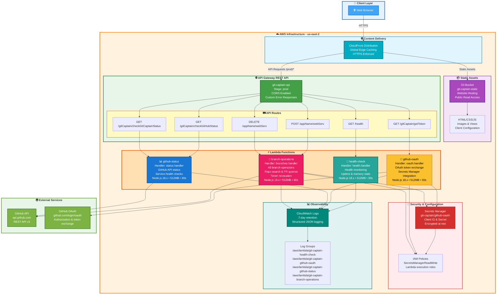

### Lambda Function Details

#### 🏥 Health Check Function (`git-captain-health-check`)
- **Handler**: `health.handler`
- **Purpose**: System health monitoring and diagnostics
- **Response Data**:
  - Service status (healthy/unhealthy)
  - Timestamp and uptime
  - Memory usage (heap used/total, RSS)
  - Environment (production/development)
  - Version information
- **No Authentication Required**
- **Endpoint**: `GET /health`

#### 🔐 GitHub OAuth Function (`git-captain-github-oauth`)
- **Handler**: `oauth.handler`
- **Purpose**: GitHub OAuth 2.0 token exchange
- **Process Flow**:
  1. Receives authorization code from GitHub
  2. Retrieves client credentials from Secrets Manager
  3. Exchanges code for access token
  4. Returns token to client for API operations
- **Security**: 
  - Secrets cached in Lambda execution context
  - IAM role with SecretsManagerReadWrite policy
  - CORS enabled for cross-origin requests
- **Endpoint**: `GET /gitCaptain/getToken?code={auth_code}`

#### 📊 GitHub Status Function (`git-captain-github-status`)
- **Handler**: `status.handler`
- **Purpose**: Service and GitHub API health checks
- **Endpoints**:
  - `GET /gitCaptain/checkGitHubStatus` - GitHub API status
  - `GET /gitCaptain/checkGitCaptainStatus` - Git-Captain service status
- **Response Data**:
  - API availability status
  - Response time metrics
  - Service operational status
  - Configuration validation
- **No Authentication Required**

#### 🌿 Branch Operations Function (`git-captain-branch-operations`)
- **Handler**: `branches.handler`
- **Purpose**: All GitHub repository and branch operations
- **Supported Operations**:
  - **Repository Search**: List user and organization repositories
  - **Branch Creation**: Create new branches from base branches
  - **Branch Search**: Find specific branches in repositories
  - **Branch Deletion**: Remove branches from repositories
  - **PR Search**: Query pull requests by various filters
  - **Token Revocation**: Logout and invalidate GitHub tokens
- **Authentication**: Requires valid GitHub OAuth token
- **Endpoints**:
  - `POST /{appName}/{webServ}` - Branch operations via path parameters
  - `DELETE /{appName}/{webServ}` - Branch deletion
- **GitHub API Integration**:
  - User-Agent: "Git-Captain"
  - Bearer token authentication
  - Comprehensive error handling
  - Rate limit awareness

### Static Asset Delivery

#### S3 + CloudFront Architecture
- **S3 Bucket**: `git-captain-static-{AWS::AccountId}`
  - Website hosting configuration
  - Public read access via bucket policy
  - CORS enabled for API integration
  - Serves: HTML pages, CSS stylesheets, JavaScript files, images

- **CloudFront Distribution**:
  - Global edge caching for low latency
  - HTTPS enforced (redirect-to-https)
  - Custom error responses (404 → /views/404.html)
  - Dual origin configuration:
    - **S3 Origin**: Static assets (default behavior)
    - **API Origin**: API Gateway for `/prod/*` paths
  - Cache behaviors:
    - Static assets: cached at edge locations
    - API requests: query strings and headers forwarded

### Security Architecture

#### Secrets Management
- **AWS Secrets Manager** stores GitHub OAuth credentials
- Secret name: `git-captain/github-oauth`
- JSON structure:
  ```json
  {
    "client_id": "...",
    "client_secret": "..."
  }
  ```
- Encrypted at rest with AWS KMS
- IAM policies restrict access to Lambda functions only
- Secrets cached in Lambda execution context for performance

#### IAM Policies
- Lambda execution roles with least-privilege access
- `SecretsManagerReadWrite` policy for OAuth and Branch functions
- CloudWatch Logs write permissions
- API Gateway invocation permissions

#### CORS Configuration
- API Gateway CORS enabled:
  - Allow-Methods: GET, POST, DELETE, OPTIONS
  - Allow-Headers: Content-Type, Authorization, X-Amz-Date, X-Api-Key
  - Allow-Origin: * (configure for production domains)
- Custom error responses include CORS headers
- S3 bucket CORS for cross-origin asset loading

### Monitoring & Logging

#### CloudWatch Integration
- **Log Groups** (7-day retention):
  - `/aws/lambda/git-captain-health-check`
  - `/aws/lambda/git-captain-github-oauth`
  - `/aws/lambda/git-captain-github-status`
  - `/aws/lambda/git-captain-branch-operations`

- **Log Structure**:
  - Structured JSON logging
  - Request/response tracking
  - Error stack traces
  - GitHub API interaction logs
  - OAuth flow tracing

- **Metrics Available**:
  - Invocation count and duration
  - Error rate and throttling
  - Memory utilization
  - Cold start frequency

### Deployment Configuration

#### SAM Template Parameters
- `GitHubClientId`: OAuth application client ID (NoEcho)
- `GitHubClientSecret`: OAuth application client secret (NoEcho)
- `GitHubOrgName`: Target GitHub organization/user (default: ConfusedDeer)
- `DomainName`: Optional custom domain configuration

#### Global Function Configuration
- **Runtime**: Node.js 18.x
- **Memory**: 512 MB
- **Timeout**: 30 seconds
- **Architecture**: x86_64
- **Environment Variables**:
  - `NODE_ENV=production`
  - `GITHUB_ORG_NAME` (from parameter)
  - `GIT_CAPTAIN_STATUS=up`
  - `GIT_CAPTAIN_REASON=Service is operational`
  - `TIMEOUT_MINUTES=25`
  - `RATE_LIMIT_WINDOW=60000` (1 minute)
  - `RATE_LIMIT_MAX=60` (60 requests per window)
  - `SESSION_TIMEOUT=1800000` (30 minutes)

#### Stack Outputs
- **ApiUrl**: API Gateway endpoint (`https://{api-id}.execute-api.{region}.amazonaws.com/prod`)
- **CloudFrontUrl**: CloudFront distribution domain name
- **StaticAssetsBucket**: S3 bucket name for asset uploads
- **SecretsArn**: Secrets Manager ARN for reference

## 🔧 Error Handling & Recovery Architecture

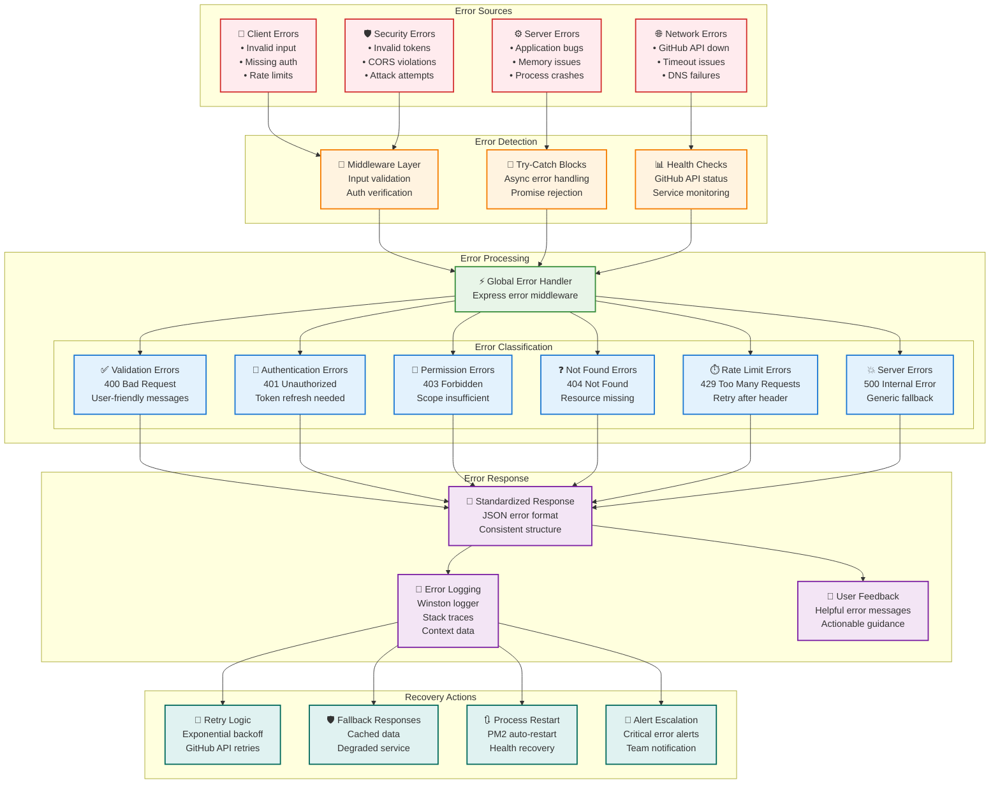

## 🔄 Lambda Request Flow Diagram

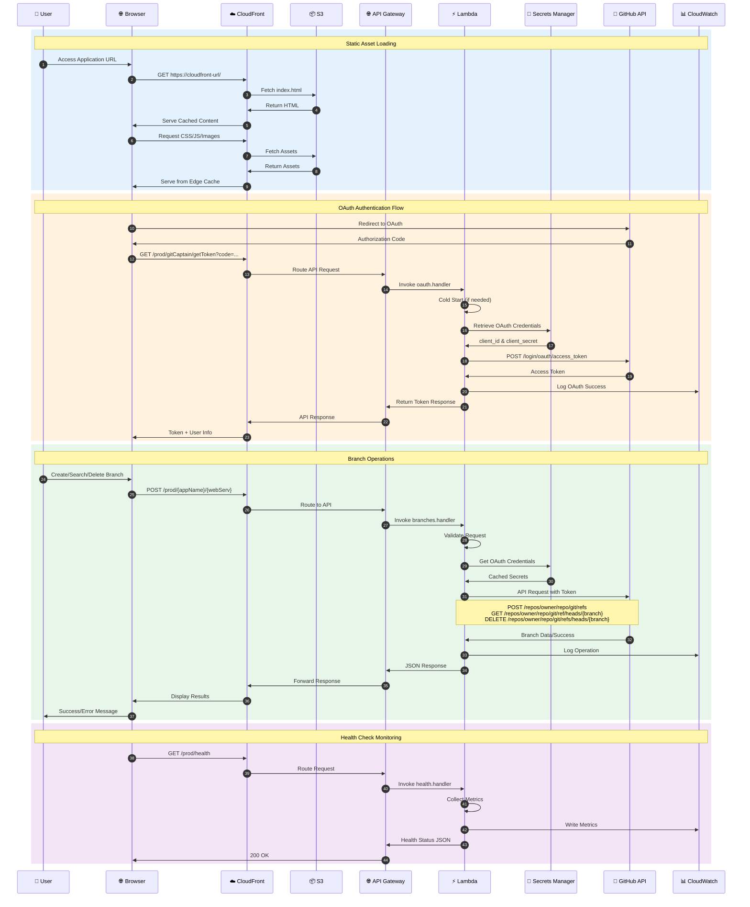

## 🔄 EC2 Request Flow Diagram (Legacy)

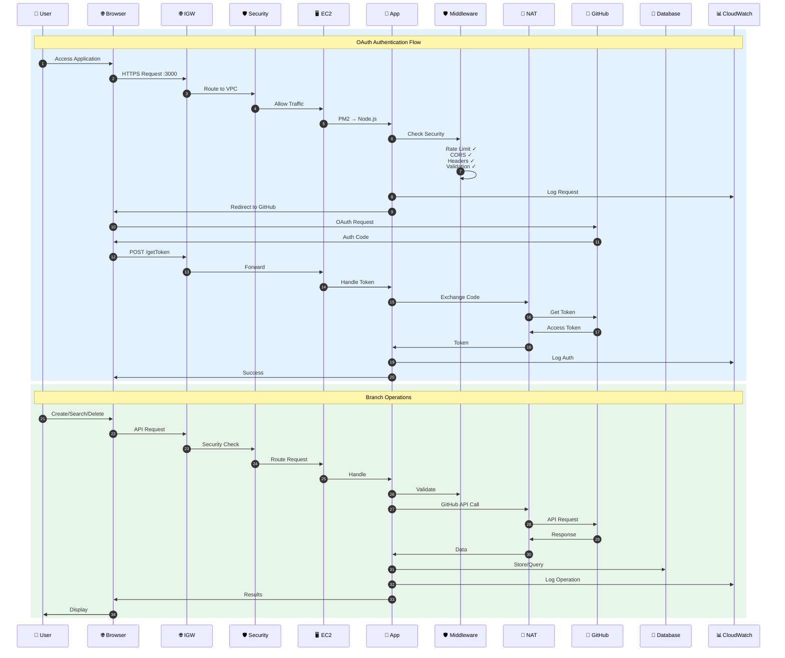

## 🏢 Component Architecture

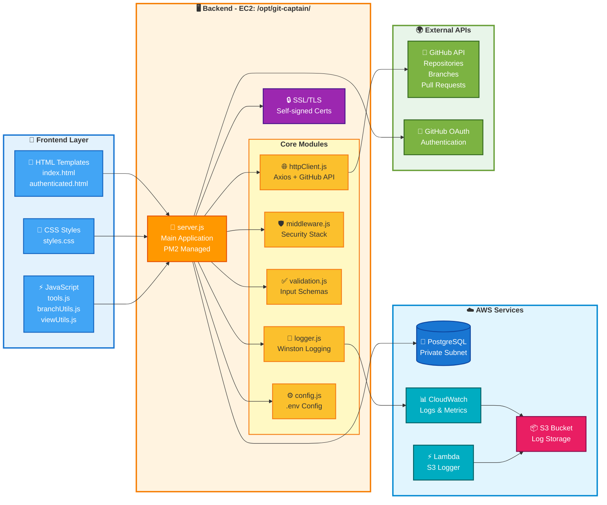

## 🔧 Technology Stack

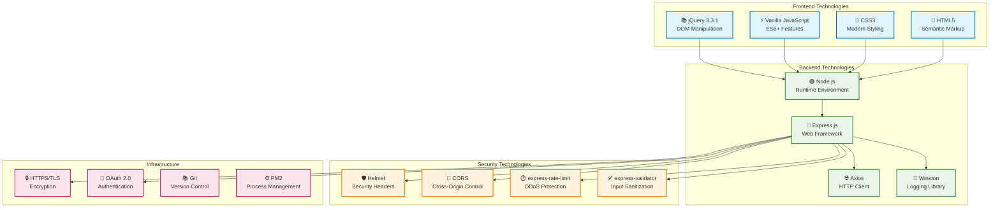

## 🔗 Data Flow & API Architecture

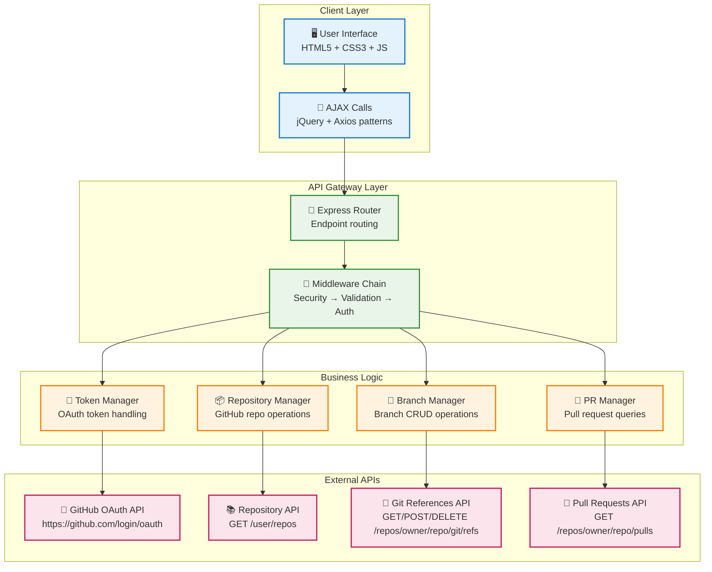

## 📋 API Endpoints Overview

### Lambda Deployment (Current)

| Endpoint | Method | Lambda Function | Purpose | Authentication |
|----------|--------|----------------|---------|----------------|
| `/health` | GET | health-check | Health monitoring | None |
| `/gitCaptain/getToken` | GET | github-oauth | OAuth token exchange | OAuth code |
| `/gitCaptain/checkGitHubStatus` | GET | github-status | Check GitHub API status | None |
| `/gitCaptain/checkGitCaptainStatus` | GET | github-status | Check service status | None |
| `/{appName}/{webServ}` | POST | branch-operations | Branch operations (create/search) | GitHub token |
| `/api/v1/{appName}/{webServ}` | POST | branch-operations | API v1 branch operations | GitHub token |
| `/{appName}/{webServ}` | DELETE | branch-operations | Delete branch | GitHub token |
| `/{appName}/{webServ}` | GET | branch-operations | Get branch info | GitHub token |

**Note**: All API endpoints are prefixed with `/prod` via API Gateway stage.

### EC2 Deployment (Legacy)

| Endpoint | Method | Purpose | Rate Limit | Authentication |
|----------|--------|---------|------------|----------------|
| `/` | GET | Landing page | General | None |
| `/gitCaptain/getToken` | GET/POST | OAuth token exchange | Auth (300/5min) | OAuth code |
| `/authenticated.html` | GET | OAuth callback page | General | None |
| `/gitCaptain/createBranch` | POST | Create new branch | Auth (300/5min) | GitHub token |
| `/gitCaptain/searchForBranch` | POST | Search branches | Auth (300/5min) | GitHub token |
| `/gitCaptain/deleteBranch` | POST | Delete branch | Auth (300/5min) | GitHub token |
| `/gitCaptain/searchForRepos` | POST | Search repositories | Auth (300/5min) | GitHub token |
| `/static/*` | GET | Static assets | General | None |

## 🔄 Architecture Comparison: Lambda vs EC2

| Aspect | Lambda Microservices | EC2 Traditional |
|--------|---------------------|-----------------|
| **Deployment Model** | Serverless, event-driven | Always-on server process |
| **Scaling** | Automatic, per-request | Manual or Auto Scaling Group |
| **Cost Model** | Pay-per-invocation + duration | Continuous instance cost |
| **Cold Start** | 100-500ms initial latency | No cold starts |
| **Maintenance** | Minimal, AWS-managed runtime | OS patching, PM2 management |
| **Static Assets** | S3 + CloudFront CDN | Express static middleware |
| **OAuth Secrets** | Secrets Manager (encrypted) | .env file on instance |
| **Logging** | CloudWatch Logs (7-day retention) | Winston file logs (14-day rotation) |
| **Monitoring** | CloudWatch metrics (automatic) | Custom monitoring + PM2 |
| **Failover** | Built-in multi-AZ redundancy | Requires ALB + multi-instance |
| **Request Timeout** | 30 seconds (Lambda limit) | Configurable (unlimited) |
| **Concurrency** | 1000 concurrent executions (default) | Limited by instance size |
| **State Management** | Stateless (function lifecycle) | Can maintain in-memory state |
| **GitHub API Rate** | Shared across invocations | Per-instance IP address |
| **SSL/TLS** | AWS-managed (CloudFront) | Self-signed or Let's Encrypt |
| **CORS Handling** | API Gateway + S3 CORS | Express middleware |
| **Security Groups** | Not applicable | VPC security groups |
| **NAT Gateway** | Not required | Required for private subnets |
| **Database** | No persistent storage | Optional RDS PostgreSQL |
| **Health Checks** | Lambda endpoint | Express endpoint + PM2 |
| **Rollback** | SAM deploy with previous version | Manual git revert + restart |
| **Development** | Local SAM CLI testing | Standard Node.js debugging |
| **CI/CD** | AWS CodePipeline, GitHub Actions | Traditional deployment scripts |

### When to Use Lambda
✅ Variable traffic patterns  
✅ Cost optimization for low/medium traffic  
✅ Quick scaling requirements  
✅ Minimal operational overhead  
✅ Event-driven workflows  
✅ Global CDN distribution needed  

### When to Use EC2
✅ Consistent high traffic  
✅ Sub-100ms latency requirements  
✅ Long-running operations (>30s)  
✅ Complex in-memory caching  
✅ Direct database connections  
✅ Full OS-level control needed

## 🔒 Security Architecture

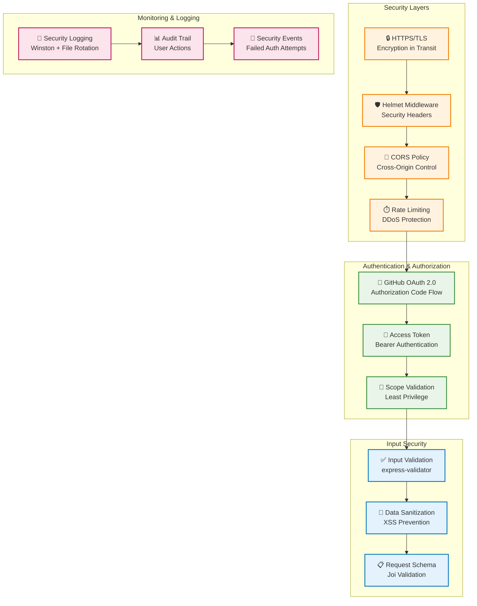

## 🗂️ Project Structure

```
Git-Captain/
├── 📁 lambda/                        # ⚡ AWS Lambda Functions (Serverless)
│   ├── 🏥 health.js                 # Health check Lambda handler
│   ├── 🔐 oauth.js                  # GitHub OAuth token exchange
│   ├── 📊 status.js                 # Status check handlers
│   ├── 🌿 branches.js               # Branch operations (main handler)
│   ├── 🐍 s3-upload-logger.py       # S3 audit log processor (Python)
│   ├── 📦 package.json              # Lambda dependencies
│   └── 📖 README.md                 # Lambda deployment guide
├── 📁 controllers/                   # 🖥️ Backend Core (EC2/Traditional)
│   ├── 🔧 server.js                 # Main Express application server
│   ├── 🌐 httpClient.js             # Axios-based HTTP client
│   ├── 🛡️ middleware.js             # Security middleware stack
│   ├── ✅ validation.js             # Input validation schemas
│   ├── 📝 logger.js                 # Winston logging configuration
│   ├── ⚙️ config.js                 # Environment & app configuration
│   └── 🔒 security.js               # Security utilities
├── 📁 public/                       # 🎨 Frontend Assets (S3/Static)
│   ├── 📁 css/                      # Stylesheets
│   │   └── 🎨 styles.css           # Main UI styling
│   ├── 📁 js/                       # Client-side JavaScript
│   │   ├── 🔧 tools.js              # API interaction utilities
│   │   ├── 🌿 branchUtils.js        # Branch operation helpers
│   │   └── ⚙️ viewUtils.js          # UI manipulation utilities
│   ├── 📁 images/                   # Static images & favicon
│   └── 📁 views/                    # HTML templates
│       ├── 📄 index.html            # Landing page
│       └── 🔐 authenticated.html    # OAuth callback page
├── 📁 cloudformation/               # ☁️ CloudFormation Templates
│   ├── complete-stack.yaml          # Full stack deployment
│   ├── ec2-alb-autoscaling.yaml     # EC2 with load balancing
│   ├── lambda-s3-logging.yaml       # Lambda + S3 audit system
│   ├── cloudwatch-monitoring.yaml   # Monitoring & alerting
│   ├── rds.yaml                     # RDS PostgreSQL database
│   └── waf.yaml                     # Web Application Firewall
├── 📁 terraform/                    # 🔧 Terraform IaC (Alternative)
│   ├── main.tf                      # Main Terraform configuration
│   ├── outputs.tf                   # Output definitions
│   └── README.md                    # Terraform usage guide
├── 📁 docs/                         # 📚 Documentation
│   ├── 📋 ARCHITECTURE.md           # System architecture (this file)
│   ├── 🚀 DEPLOYMENT.md             # Deployment guide
│   ├── 🔒 SECURITY.md               # Security documentation
│   └── 📁 aws/                      # AWS-specific documentation
├── 📁 logs/                         # 📄 Application logs (EC2 only)
│   ├── 📄 git-captain-YYYY-MM-DD.log # Daily application logs
│   └── 🚨 git-captain-errors-YYYY-MM-DD.log # Error logs
├── 📁 test/                         # 🧪 Test suites
│   └── 🧪 security.test.js          # Security tests
├── 📁 scripts/                      # ⚙️ Utility scripts
│   └── ⚙️ setup.js                  # Environment setup
├── 📁 boto3-scripts/                # 🐍 Python AWS automation
│   ├── ec2_operations.py            # EC2 management scripts
│   ├── s3_operations.py             # S3 bucket operations
│   └── lambda_test.py               # Lambda testing utilities
├── 📁 ec2-scripts/                  # 🖥️ EC2 deployment scripts
│   ├── user-data.sh                 # EC2 initialization script
│   ├── health-check.sh              # Health monitoring script
│   └── app-update.sh                # Application update automation
├── 🔐 .env                          # Environment variables (EC2)
├── ☁️ template.yaml                  # AWS SAM template (Lambda deployment)
├── ☁️ samconfig.toml                 # SAM CLI configuration
├── 📦 package.json                  # Node.js dependencies (EC2)
├── 📋 MODULE_UPDATES.md             # Modernization changelog
├── 📖 README.md                     # Project overview
├── ⚙️ SETUP.md                      # Setup instructions
├── ☁️ AWS_DEPLOYMENT_CHECKLIST.md   # AWS deployment guide
├── ☁️ AWS_QUICK_REFERENCE.md        # AWS resource reference
├── ☁️ LAMBDA_DEPLOYMENT.md          # Lambda-specific deployment
├── ☁️ SERVERLESS_QUICKSTART.md      # Serverless quick start
└── 📄 LICENSE                       # MIT License
```

### Directory Purpose Summary

#### Lambda Functions (`lambda/`)
AWS Lambda serverless functions for scalable, event-driven architecture:
- **health.js**: Health monitoring endpoint
- **oauth.js**: GitHub OAuth 2.0 authentication
- **status.js**: Service status checks
- **branches.js**: Main handler for all branch operations
- **s3-upload-logger.py**: Python-based S3 audit log processor

#### Controllers (`controllers/`)
Traditional server-based backend for EC2 deployments:
- Express.js server with comprehensive middleware
- Security, validation, logging layers
- Direct GitHub API integration

#### Public Assets (`public/`)
Frontend static files served via:
- **Lambda**: S3 + CloudFront CDN
- **EC2**: Express static file serving

#### Infrastructure as Code
- **cloudformation/**: AWS CloudFormation YAML templates
- **terraform/**: Terraform HCL configurations
- **template.yaml**: AWS SAM (Serverless Application Model)

#### Deployment Scripts
- **ec2-scripts/**: EC2-specific deployment automation
- **boto3-scripts/**: Python AWS SDK automation
- **PowerShell scripts**: Windows deployment helpers

## 🔄 OAuth Flow Architecture

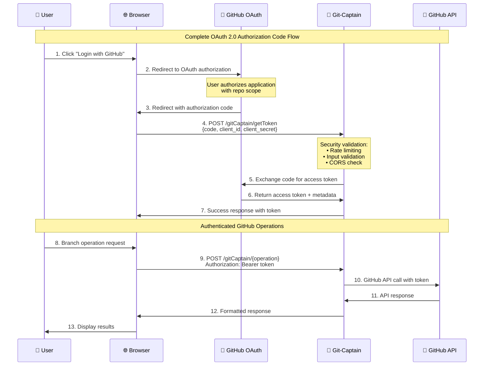

## 🛡️ Enhanced Security Flow

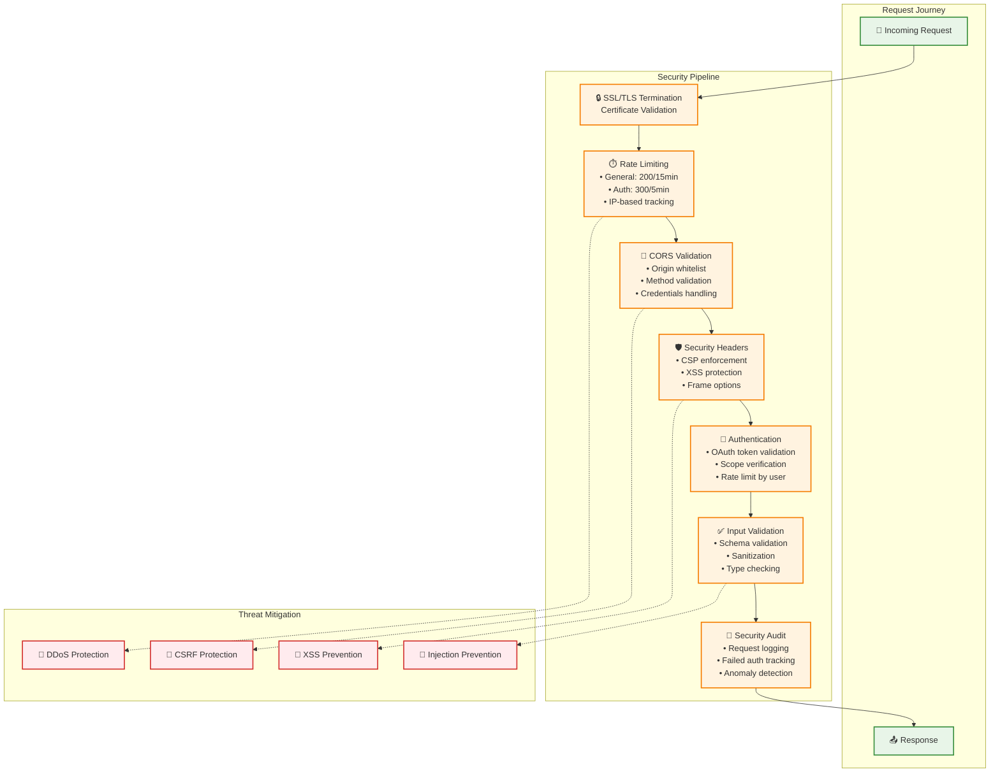

### Rate Limiting Strategy
- **General endpoints**: 200 requests per 15 minutes
- **Authenticated endpoints**: 300 requests per 5 minutes  
- **Static assets**: Unlimited (served efficiently)

### Caching Strategy
- Static assets served with appropriate cache headers
- GitHub API responses cached temporarily to reduce API calls
- SSL termination at reverse proxy level for performance

### Scalability Design
- Stateless application design for horizontal scaling
- Session data stored in GitHub tokens (no server-side sessions)
- Logging designed for distributed environments
- Process management ready (PM2 compatible)

## 🔧 Configuration Management

### Environment Variables (.env)
```bash
# Server Configuration
HTTPS_PORT=3000
HTTP_PORT=3001

# GitHub OAuth
GITHUB_CLIENT_ID=your_client_id
GITHUB_CLIENT_SECRET=your_client_secret
GITHUB_CALLBACK_URL=https://yourdomain.com/authenticated.html

# Application Settings
ORG_NAME=your-github-org
REPO_NAME=your-repo-name

# Security
SSL_KEY_PATH=./controllers/theKey.key
SSL_CERT_PATH=./controllers/theCert.cert

# Logging
LOG_LEVEL=info
LOG_MAX_SIZE=10m
LOG_MAX_FILES=14
```

### Runtime Configuration (config.js)
- Environment variable validation using Joi
- Default value fallbacks for development
- SSL certificate loading and validation
- GitHub API endpoint configuration

## 🚀 Deployment Architecture

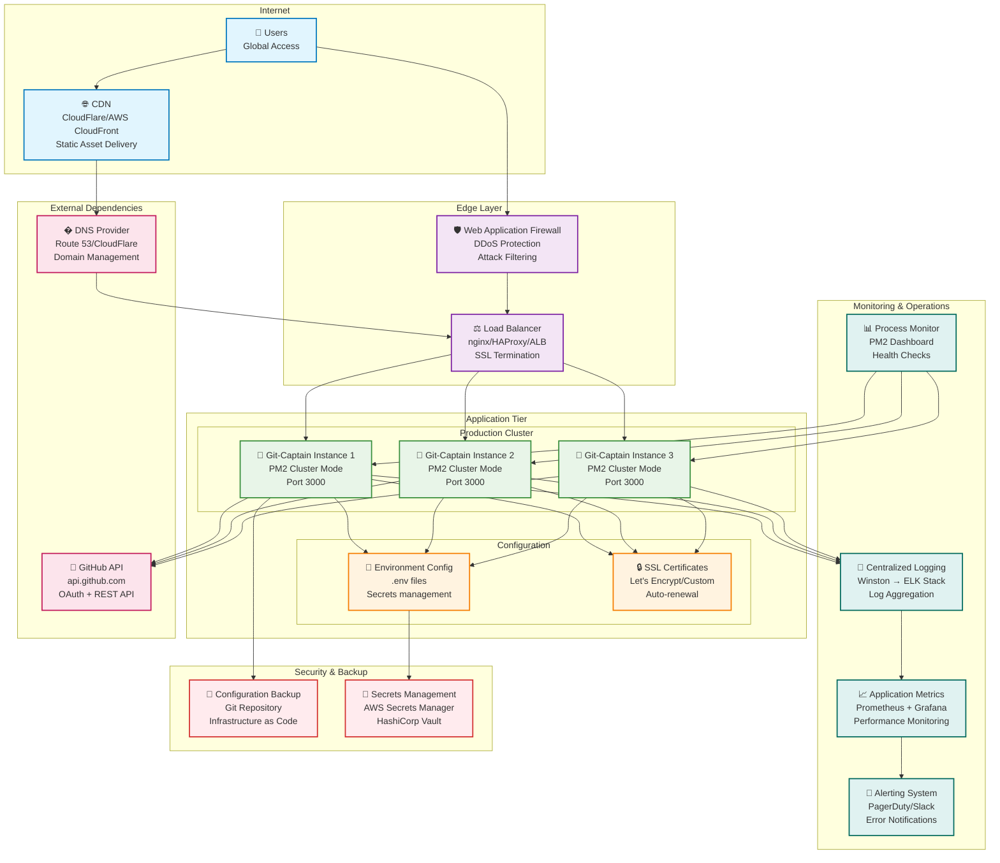

## 🧪 Testing Strategy

### Security Testing
- Input validation boundary testing
- Authentication bypass attempts  
- Rate limiting verification
- XSS and injection attack prevention

### Integration Testing  
- GitHub OAuth flow end-to-end
- API endpoint response validation
- Error handling and recovery
- SSL/TLS configuration verification

### Performance Testing
- Load testing with realistic user patterns
- Rate limit threshold validation
- Memory leak detection during extended runs
- GitHub API rate limit handling

## 📈 Monitoring & Observability

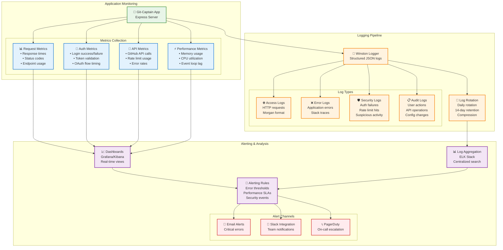

### Application Metrics
- Request count and response times
- Error rates by endpoint
- GitHub API usage and rate limits
- Authentication success/failure rates

### Infrastructure Metrics  
- CPU and memory utilization
- SSL certificate expiration monitoring
- Log file size and rotation health
- Process uptime and restart frequency

### Security Monitoring
- Failed authentication attempts
- Rate limit violations
- Suspicious request patterns
- SSL/TLS handshake failures

## 🔄 Maintenance & Updates

### Regular Maintenance Tasks
- **Weekly**: Review security logs for anomalies
- **Monthly**: Update Node.js dependencies (`npm audit` and `npm update`)
- **Quarterly**: SSL certificate renewal and validation
- **Annually**: Security audit and penetration testing

### Update Strategy
- Dependency updates tested in staging environment
- Gradual rollout with health check validation
- Rollback procedures documented and tested
- Security updates prioritized and expedited

## 📚 Related Documentation

### Lambda Microservices Deployment
- **[lambda/README.md](../lambda/README.md)** - Lambda function details and deployment
- **[LAMBDA_DEPLOYMENT.md](../LAMBDA_DEPLOYMENT.md)** - Step-by-step Lambda deployment
- **[SERVERLESS_QUICKSTART.md](../SERVERLESS_QUICKSTART.md)** - Quick start guide for serverless
- **[SERVERLESS_DEPLOYMENT.md](../SERVERLESS_DEPLOYMENT.md)** - Serverless architecture details
- **[template.yaml](../template.yaml)** - AWS SAM template for Lambda deployment
- **[samconfig.toml](../samconfig.toml)** - SAM CLI configuration

### EC2 Traditional Deployment
- **[AWS Deployment Checklist](../AWS_DEPLOYMENT_CHECKLIST.md)** - EC2 deployment guide
- **[AWS Quick Reference](../AWS_QUICK_REFERENCE.md)** - AWS resource reference
- **[AWS Implementation Summary](../AWS_IMPLEMENTATION_SUMMARY.md)** - Implementation details
- **[cloudformation/complete-stack.yaml](../cloudformation/complete-stack.yaml)** - Full EC2 stack template
- **[ec2-scripts/](../ec2-scripts/)** - EC2 deployment automation scripts

### General Documentation
- **[☁️ AWS Architecture](./aws/AWS_ARCHITECTURE.md)** - Comprehensive AWS deployment architecture
- **[README.md](../README.md)** - Project overview and quick start
- **[SETUP.md](../SETUP.md)** - Detailed setup instructions  
- **[DEPLOYMENT.md](./DEPLOYMENT.md)** - Production deployment guide
- **[SECURITY.md](./SECURITY.md)** - Security best practices and modernization
- **[MODULE_UPDATES.md](../MODULE_UPDATES.md)** - Modernization changelog
- **[SECURITY_MODERNIZATION.md](../SECURITY_MODERNIZATION.md)** - Security upgrade details

---

*This architecture document represents Git-Captain v2.0 following the comprehensive modernization and security improvements completed in 2024, with AWS Lambda microservices deployment added December 2025.*
