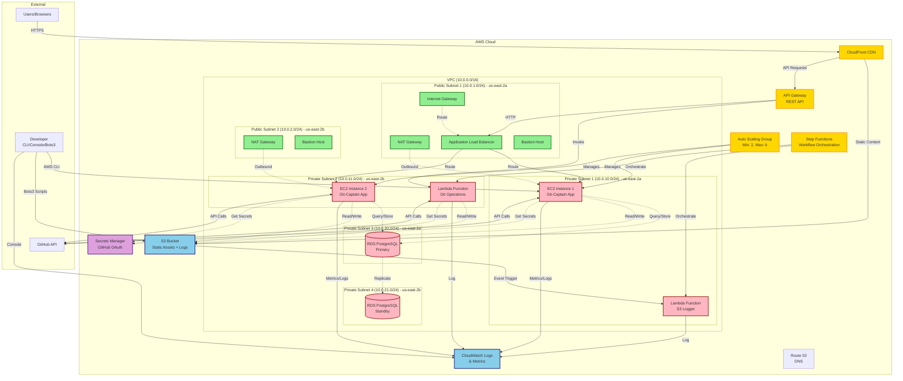

# Git-Captain AWS Architecture - Academic Project

## Architecture Components

### Networking Layer (Terraform)
- **VPC**: 10.0.0.0/16 with DNS support
- **Public Subnets**: 2 subnets across AZs for high availability
  - Internet Gateway for public internet access
  - NAT Gateways for private subnet outbound traffic
  - Application Load Balancer
  - Bastion hosts for SSH access
- **Private Subnets**: 4 subnets for application and database tiers
  - EC2 instances (Git-Captain application)
  - Lambda functions
  - RDS database (Multi-AZ)

### Compute Layer (CloudFormation)
- **EC2 Instances**: Auto-scaled web servers (2-6 instances)
- **Application Load Balancer**: Traffic distribution
- **Auto Scaling Group**: Automatic scaling based on CPU/memory
- **Lambda Functions**: 
  - S3 upload logger (CloudWatch integration)
  - Git-Captain operations (GitHub API)

### Database Layer (CloudFormation)
- **RDS PostgreSQL**: Multi-AZ deployment
  - Primary in us-east-2a
  - Standby replica in us-east-2b
  - Automated backups (7-day retention)
  - Session storage and application data

### Storage Layer
- **S3 Bucket**: 
  - Static assets (HTML, CSS, JS)
  - Application logs
  - Backup files
  - Versioning enabled
  - Lifecycle policies

### Serverless Layer (CloudFormation)
- **Lambda Functions**: Event-driven compute
- **API Gateway**: RESTful API endpoints
- **Step Functions**: Workflow orchestration
- **CloudWatch**: Centralized logging and monitoring

### Security Layer
- **Security Groups**:
  - ALB: Allow 80/443 from internet
  - EC2: Allow 3000 from ALB only
  - RDS: Allow 5432 from EC2 only
  - Lambda: Allow HTTPS outbound
- **Secrets Manager**: GitHub OAuth credentials
- **IAM Roles**: Least privilege access

### CDN & DNS
- **CloudFront**: Global content delivery
- **Route 53**: DNS management (optional)

## AWS Services Used

✅ **Networking**: VPC, Subnets, Internet Gateway, NAT Gateway, Route Tables  
✅ **Compute**: EC2, Auto Scaling, Application Load Balancer, Lambda  
✅ **Database**: RDS PostgreSQL (Multi-AZ)  
✅ **Storage**: S3 with versioning and lifecycle policies  
✅ **Serverless**: Lambda, API Gateway, Step Functions  
✅ **Infrastructure**: CloudFormation + Terraform (hybrid approach)  
✅ **Security**: Security Groups, IAM Roles, Secrets Manager  
✅ **Monitoring**: CloudWatch Logs & Metrics  
✅ **Version Control**: GitHub with CI/CD pipeline  

## Bonus Features Implemented

🎁 **API Gateway**: RESTful API for Lambda invocation  
🎁 **Step Functions**: Automated workflow orchestration  
🎁 **CI/CD Pipeline**: GitHub Actions with AWS CodeDeploy  

## Scalability Features

- **Horizontal Scaling**: Auto Scaling Group (2-6 instances)
- **Database Scaling**: RDS Multi-AZ with read replicas (optional)
- **Content Delivery**: CloudFront edge locations worldwide
- **Serverless**: Lambda scales automatically to demand
- **Storage Scaling**: S3 unlimited scalability

## High Availability

- **Multi-AZ**: Resources across 2 Availability Zones
- **Load Balancing**: ALB distributes traffic
- **Database Failover**: Automatic RDS failover
- **Auto Recovery**: Auto Scaling replaces failed instances
- **Backup**: Automated RDS backups, S3 versioning

## Cost Optimization

- **Reserved Instances**: For predictable workloads
- **Spot Instances**: For non-critical workloads
- **Lambda**: Pay per execution
- **S3 Lifecycle**: Move old data to Glacier
- **CloudWatch**: 7-day log retention

## Deployment Methods

1. **Terraform**: Networking infrastructure (VPC, subnets, security groups)
2. **CloudFormation**: Application resources (EC2, RDS, Lambda, ALB)
3. **AWS CLI**: Resource management and validation
4. **Boto3**: Python automation scripts
5. **GitHub Actions**: CI/CD automation
