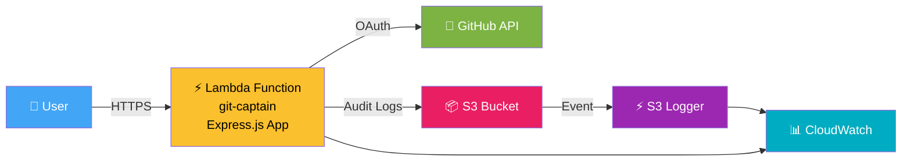
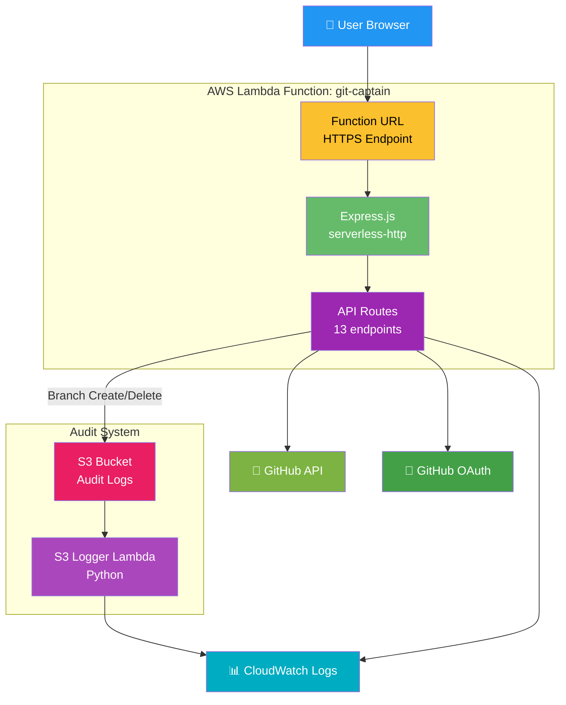

# Git-Captain - Current Architecture
## Monolithic Lambda with Audit Logging (v2.1)

## Overview

Git-Captain is currently deployed as a monolithic serverless application on AWS Lambda using a Function URL. All application routes are handled by a single Lambda function that wraps an Express.js application using the serverless-http adapter.

## Architecture Diagram

### Simplified High-Level View

### Detailed Architecture

## Architecture Components

### Lambda Function: git-captain
- **Type**: Monolithic Express.js application
- **Handler**: Wraps Express app using serverless-http
- **Runtime**: Node.js 18.x
- **Memory**: 512 MB
- **Timeout**: 30 seconds
- **Endpoint**: Lambda Function URL (public HTTPS)

### API Routes (All in Single Function)
- **GET /health** - Health check endpoint
- **GET /gitCaptain/checkGitHubStatus** - Check GitHub API status
- **GET /static/*** - Serve static assets (CSS, JS, images)
- **GET /** - Landing page with OAuth client_id injection
- **GET /authenticated.html** - OAuth callback page
- **GET /config.js** - Client configuration
- **POST /gitCaptain/getToken** - OAuth token exchange
- **POST /gitCaptain/searchForRepos** - List user repositories
- **POST /gitCaptain/createBranches** - Create new branch (with audit)
- **DELETE /gitCaptain/deleteBranches** - Delete branch (with audit)
- **POST /gitCaptain/searchForBranch** - Search for specific branch
- **POST /gitCaptain/searchForPR** - Search pull requests
- **POST /gitCaptain/logOff** - Revoke GitHub token

### Audit Logging System
- **S3 Bucket**: git-captain-logs-bucket
  - Stores audit logs for branch create/delete operations
  - JSON format with timestamp, user, action, repository details
- **S3 Logger Lambda**: git-captain-s3-logger (Python 3.9)
  - Triggered by S3 upload events
  - Logs metadata to CloudWatch for monitoring

### AWS Services Integration
- **CloudWatch Logs**: Centralized logging for Lambda execution
- **S3**: Audit trail storage with event notifications
- **Environment Variables**:
  - `GITHUB_CLIENT_ID`: OAuth application ID
  - `GITHUB_CLIENT_SECRET`: OAuth application secret
  - `GITHUB_ORG_NAME`: Target organization name
  - `NODE_ENV`: Environment (production)

### External Integrations
- **GitHub OAuth**: Authorization and token exchange
- **GitHub API**: Repository, branch, and PR operations

## Benefits of Current Architecture

✅ **Simplicity**: Single Lambda function deployment
✅ **No API Gateway costs**: Direct Function URL invocation
✅ **Quick deployment**: Minimal AWS resources
✅ **Audit logging**: S3-based audit trail for compliance
✅ **Event-driven**: S3 event triggers for log processing
✅ **Familiar development**: Standard Express.js patterns

## Limitations

⚠️ **Monolithic design**: All routes in single function
⚠️ **Limited routing flexibility**: Cannot scale individual endpoints
⚠️ **Cold starts**: Affects all routes simultaneously
⚠️ **Static assets**: Served through Lambda (not ideal for performance)

## Future Migration Path

The architecture is planned to evolve to a microservices design (v2.2) with:
- Separate Lambda functions per concern (health, oauth, status, branches)
- API Gateway for advanced routing and throttling
- S3 + CloudFront for static asset delivery
- Secrets Manager for OAuth credential storage

---

*Document generated: December 7, 2025*
*Git-Captain v2.1 - Monolithic Lambda Architecture*
