# Git-Captain AWS Architecture

## Overview

This document describes the AWS cloud architecture for deploying the Git-Captain application using Infrastructure as Code (IaC) with Terraform and CloudFormation.

## Architecture Diagram

```mermaid
graph TB
    subgraph Internet
        Users[Users/Clients]
    end

    subgraph "AWS Cloud - Region: us-east-2"
        subgraph "VPC - 10.0.0.0/16"
            subgraph "Public Subnets"
                subgraph "AZ1 - 10.0.1.0/24"
                    ALB[Application Load Balancer<br/>HTTPS:443]
                    NAT[NAT Gateway]
                end
                subgraph "AZ2 - 10.0.2.0/24"
                    ALB2[ALB Standby]
                end
            end

            subgraph "Private Subnets"
                subgraph "AZ1 - 10.0.10.0/24"
                    EC2_1[EC2 Instance 1<br/>t3.micro<br/>Node.js App:3000]
                    RDS_1[RDS PostgreSQL<br/>Primary]
                end
                subgraph "AZ2 - 10.0.11.0/24"
                    EC2_2[EC2 Instance 2-6<br/>t3.micro<br/>Node.js App:3000]
                    RDS_2[RDS Standby<br/>Optional Multi-AZ]
                end
            end
        end

        subgraph "Serverless Services"
            Lambda[AWS Lambda<br/>S3 Upload Logger<br/>Python 3.11]
            S3_Static[S3 Bucket<br/>Static Assets<br/>CSS/JS/Images]
            S3_Logs[S3 Bucket<br/>Application Logs<br/>Lifecycle: 90 days]
            S3_SSL[S3 Bucket<br/>SSL Certificates<br/>Encrypted]
        end

        subgraph "Monitoring & Logging"
            CW_Logs[CloudWatch Logs<br/>/aws/ec2/git-captain]
            CW_Metrics[CloudWatch Metrics<br/>CPU, Memory, Requests]
            CW_Alarms[CloudWatch Alarms<br/>SNS Notifications]
            Dashboard[CloudWatch Dashboard<br/>Real-time Monitoring]
        end

        subgraph "Security Services"
            WAF[AWS WAF<br/>Rate Limiting<br/>SQL Injection Protection]
            SM[Secrets Manager<br/>GitHub OAuth<br/>DB Credentials]
            ACM[Certificate Manager<br/>SSL/TLS Certificates]
            SG_ALB[Security Group: ALB<br/>Inbound: 443, 80]
            SG_EC2[Security Group: EC2<br/>Inbound: 3000 from ALB]
            SG_RDS[Security Group: RDS<br/>Inbound: 5432 from EC2]
        end

        subgraph "Auto Scaling"
            ASG[Auto Scaling Group<br/>Min: 2, Max: 6<br/>Target CPU: 70%]
            LaunchTemplate[Launch Template<br/>Amazon Linux 2023<br/>User Data Script]
        end
    end

    subgraph "External Services"
        GitHub[GitHub API<br/>api.github.com<br/>OAuth & Repository Ops]
    end

    Users -->|HTTPS:443| ALB
    ALB -->|HTTP:3000| EC2_1
    ALB -->|HTTP:3000| EC2_2
    EC2_1 -->|PostgreSQL:5432| RDS_1
    EC2_2 -->|PostgreSQL:5432| RDS_1
    EC2_1 -.->|via NAT| GitHub
    EC2_2 -.->|via NAT| GitHub
    EC2_1 -->|Secrets| SM
    EC2_2 -->|Secrets| SM
    EC2_1 -->|Logs| CW_Logs
    EC2_2 -->|Logs| CW_Logs
    S3_Logs -->|ObjectCreated Event| Lambda
    Lambda -->|Write Logs| CW_Logs
    WAF -->|Protect| ALB
    ASG -.->|Manages| EC2_1
    ASG -.->|Manages| EC2_2
    LaunchTemplate -.->|Template for| ASG
    CW_Metrics -->|Trigger| CW_Alarms
    CW_Alarms -->|Email/SMS| Users
    ACM -.->|TLS Cert| ALB

    style ALB fill:#FF9900
    style EC2_1 fill:#FF9900
    style EC2_2 fill:#FF9900
    style RDS_1 fill:#3B48CC
    style Lambda fill:#FF9900
    style S3_Static fill:#569A31
    style S3_Logs fill:#569A31
    style WAF fill:#DD344C
    style SM fill:#DD344C
```



## Network Architecture

### VPC Configuration
- **CIDR Block**: 10.0.0.0/16
- **Region**: us-east-2 (Ohio)
- **Availability Zones**: 2 (us-east-2a, us-east-2b)

### Subnets

#### Public Subnets (Internet-Facing)
- **Purpose**: Application Load Balancer, NAT Gateway
- **AZ1**: 10.0.1.0/24 (us-east-2a)
- **AZ2**: 10.0.2.0/24 (us-east-2b)
- **Internet Gateway**: Yes
- **Auto-assign Public IP**: Yes

#### Private Subnets (Internal)
- **Purpose**: EC2 Instances, RDS Database
- **AZ1**: 10.0.10.0/24 (us-east-2a)
- **AZ2**: 10.0.11.0/24 (us-east-2b)
- **Internet Gateway**: No (uses NAT Gateway)
- **Auto-assign Public IP**: No

### Routing

#### Public Route Table
- **Route 1**: 10.0.0.0/16 → Local (VPC)
- **Route 2**: 0.0.0.0/0 → Internet Gateway

#### Private Route Table
- **Route 1**: 10.0.0.0/16 → Local (VPC)
- **Route 2**: 0.0.0.0/0 → NAT Gateway (for GitHub API access)

## Compute Layer

### EC2 Instances (Auto Scaling Group)
- **AMI**: Amazon Linux 2023 (latest)
- **Instance Type**: t3.micro
- **Min Size**: 2 instances
- **Max Size**: 6 instances
- **Desired Capacity**: 2 instances
- **Scaling Policy**: Target Tracking (CPU 70%)
- **Health Check**: ELB + EC2
- **Health Check Grace Period**: 300 seconds

### Launch Template
- **Node.js Version**: 18.x
- **Process Manager**: PM2
- **Application Path**: /opt/git-captain
- **User Data Script**: `ec2-scripts/user-data.sh`
- **IAM Role**: git-captain-prod-ec2-role
- **Security Group**: git-captain-prod-ec2-sg

### Application Load Balancer (ALB)
- **Type**: Application Load Balancer
- **Scheme**: Internet-facing
- **IP Address Type**: IPv4
- **Listeners**:
  - HTTPS:443 → Forward to Target Group (with ACM certificate)
  - HTTP:80 → Redirect to HTTPS:443
- **Target Group**:
  - Protocol: HTTP
  - Port: 3000
  - Health Check Path: `/gitCaptain/checkGitCaptainStatus`
  - Health Check Interval: 30 seconds
  - Healthy Threshold: 2
  - Unhealthy Threshold: 3

## Database Layer

### RDS PostgreSQL
- **Engine**: PostgreSQL 15.4
- **Instance Class**: db.t3.micro
- **Storage**: 20 GB (gp3)
- **Storage Encryption**: Yes (AES-256)
- **Multi-AZ**: No (can be enabled for production)
- **Backup Retention**: 7 days
- **Backup Window**: 03:00-04:00 UTC
- **Maintenance Window**: Sunday 04:00-05:00 UTC
- **Database Name**: gitcaptain
- **Master Username**: Stored in Secrets Manager
- **Master Password**: Stored in Secrets Manager
- **CloudWatch Logs**: Enabled (postgresql logs)

### Database Schema (Future Use)
```sql
-- Users table for tracking authenticated users
CREATE TABLE users (
    id SERIAL PRIMARY KEY,
    github_id VARCHAR(255) UNIQUE NOT NULL,
    username VARCHAR(255) NOT NULL,
    last_login TIMESTAMP DEFAULT CURRENT_TIMESTAMP,
    created_at TIMESTAMP DEFAULT CURRENT_TIMESTAMP
);

-- Operations table for audit logging
CREATE TABLE operations (
    id SERIAL PRIMARY KEY,
    user_id INTEGER REFERENCES users(id),
    operation_type VARCHAR(50) NOT NULL, -- 'create_branch', 'delete_branch', 'search_pr'
    repositories JSONB, -- Array of repository names
    branch_name VARCHAR(255),
    success BOOLEAN DEFAULT TRUE,
    error_message TEXT,
    timestamp TIMESTAMP DEFAULT CURRENT_TIMESTAMP
);

-- API calls table for performance monitoring
CREATE TABLE api_calls (
    id SERIAL PRIMARY KEY,
    endpoint VARCHAR(255) NOT NULL,
    method VARCHAR(10) NOT NULL,
    response_time INTEGER, -- milliseconds
    status_code INTEGER,
    timestamp TIMESTAMP DEFAULT CURRENT_TIMESTAMP
);
```

## Storage Layer

### S3 Buckets

#### Static Assets Bucket
- **Name**: git-captain-static-assets
- **Purpose**: CSS, JavaScript, images
- **Encryption**: AES-256
- **Versioning**: Enabled
- **Public Access**: Blocked (served via CloudFront or ALB)
- **Lifecycle**: None

#### Logs Bucket
- **Name**: git-captain-logs-bucket
- **Purpose**: Application logs, backup files
- **Encryption**: AES-256
- **Versioning**: Enabled
- **Public Access**: Blocked
- **Lifecycle**:
  - Delete logs after 90 days
  - Transition backups to Standard-IA after 30 days
  - Transition backups to Glacier after 90 days

#### SSL Certificates Bucket
- **Name**: git-captain-ssl-certs
- **Purpose**: Self-signed or custom SSL certificates
- **Encryption**: AES-256
- **Versioning**: Enabled
- **Public Access**: Blocked
- **Access**: EC2 instances only via IAM role

## Serverless Layer

### Lambda Function: S3 Upload Logger
- **Runtime**: Python 3.11
- **Handler**: index.lambda_handler
- **Memory**: 256 MB
- **Timeout**: 30 seconds
- **Trigger**: S3 ObjectCreated events from logs bucket
- **Environment Variables**:
  - LOG_GROUP_NAME: /aws/s3-uploads/git-captain
  - PROJECT_NAME: git-captain
  - ENVIRONMENT: prod
- **IAM Permissions**:
  - s3:GetObject, s3:ListBucket
  - logs:CreateLogGroup, logs:CreateLogStream, logs:PutLogEvents

### Lambda Function Code
```python
# See cloudformation/lambda-s3-logging.yaml for full implementation
def lambda_handler(event, context):
    # Parse S3 event
    # Extract file metadata (bucket, key, size, content type)
    # Log to CloudWatch with structured JSON
    # Return success
```

## Security Architecture

### Security Groups

#### ALB Security Group
- **Inbound Rules**:
  - HTTPS (443) from 0.0.0.0/0
  - HTTP (80) from 0.0.0.0/0
- **Outbound Rules**:
  - TCP (3000) to EC2 Security Group

#### EC2 Security Group
- **Inbound Rules**:
  - TCP (3000) from ALB Security Group
  - SSH (22) from allowed CIDR (changeable)
- **Outbound Rules**:
  - All traffic to 0.0.0.0/0 (for GitHub API, npm, etc.)

#### RDS Security Group
- **Inbound Rules**:
  - PostgreSQL (5432) from EC2 Security Group only
- **Outbound Rules**:
  - All traffic to 0.0.0.0/0

#### Lambda Security Group
- **Inbound Rules**: None
- **Outbound Rules**:
  - HTTPS (443) to 0.0.0.0/0 (for S3 and CloudWatch)

### AWS WAF Rules
- **Rate Limiting**: 2000 requests per IP per 5 minutes
- **AWS Managed Rules**:
  - Core Rule Set (common attacks)
  - Known Bad Inputs Rule Set
  - SQL Injection Rule Set
- **Custom Rules**:
  - Block directory traversal attempts (../)
  - Block XSS attempts (<script)

### Secrets Manager
- **Secret Name**: git-captain/prod
- **Contents**:
  - client_id (GitHub OAuth)
  - client_secret (GitHub OAuth)
  - GITHUB_ORG_NAME
  - GIT_PORT_ENDPOINT
  - All other .env variables
- **Rotation**: Not enabled (manual for OAuth)
- **Access**: EC2 instances via IAM role

### Certificate Manager (ACM)
- **Domain**: your-domain.com (configure in CloudFormation)
- **Validation**: DNS or Email
- **Automatic Renewal**: Yes
- **Used By**: Application Load Balancer HTTPS listener

## Monitoring & Logging

### CloudWatch Logs

#### Log Groups
- **/aws/ec2/git-captain/application**: Winston application logs
- **/aws/ec2/git-captain/errors**: Winston error logs
- **/aws/ec2/git-captain/bootstrap**: User data script logs
- **/aws/lambda/git-captain-prod-s3-upload-logger**: Lambda function logs
- **/aws/s3-uploads/git-captain**: S3 file upload logs (from Lambda)
- **/aws/wafv2/git-captain-prod**: WAF blocked requests

#### Log Retention
- Application logs: 30 days
- Error logs: 60 days
- Lambda logs: 30 days
- S3 upload logs: 60 days
- WAF logs: 30 days

### CloudWatch Metrics

#### EC2 Metrics
- CPUUtilization
- NetworkIn / NetworkOut
- DiskReadBytes / DiskWriteBytes
- StatusCheckFailed

#### ALB Metrics
- RequestCount
- HTTPCode_Target_2XX_Count
- HTTPCode_Target_4XX_Count
- HTTPCode_Target_5XX_Count
- TargetResponseTime
- HealthyHostCount / UnHealthyHostCount

#### RDS Metrics
- CPUUtilization
- DatabaseConnections
- FreeableMemory
- ReadLatency / WriteLatency
- NetworkReceiveThroughput / NetworkTransmitThroughput

#### Lambda Metrics
- Invocations
- Errors
- Duration
- Throttles
- ConcurrentExecutions

### CloudWatch Alarms

| Alarm | Metric | Threshold | Action |
|-------|--------|-----------|--------|
| ALB 5xx Errors | HTTPCode_Target_5XX_Count | > 10 in 5 min | SNS notification |
| ALB 4xx Errors | HTTPCode_Target_4XX_Count | > 50 in 5 min | SNS notification |
| ALB Response Time | TargetResponseTime | > 3 sec avg | SNS notification |
| Unhealthy Targets | UnHealthyHostCount | >= 1 | SNS notification |
| ASG High CPU | CPUUtilization | > 80% avg | SNS notification |
| Lambda Errors | Errors | > 5 in 5 min | SNS notification |
| Lambda Throttles | Throttles | > 1 | SNS notification |

### CloudWatch Dashboard

**Widgets**:
1. ALB Request Metrics (Total, 2xx, 4xx, 5xx)
2. ALB Response Time (Average, p99)
3. Target Health (Healthy vs Unhealthy)
4. EC2 CPU Utilization
5. Lambda Metrics (Invocations, Errors, Throttles)
6. Recent Application Errors (Log Insights query)

## Deployment Architecture

### Infrastructure as Code

#### Terraform (Networking Layer)
- **Location**: `terraform/`
- **Manages**:
  - VPC and subnets
  - Internet Gateway
  - NAT Gateway
  - Route tables
  - Security groups
- **State**: Local (can be configured for S3 backend)
- **Outputs**: Stored in SSM Parameter Store for CloudFormation

#### CloudFormation (Application Layer)
- **Location**: `cloudformation/`
- **Templates**:
  - `ec2-alb-autoscaling.yaml`: EC2, ALB, Auto Scaling
  - `rds.yaml`: RDS PostgreSQL database
  - `lambda-s3-logging.yaml`: Lambda function and S3 buckets
  - `cloudwatch-monitoring.yaml`: Alarms and dashboard
  - `waf.yaml`: WAF rules and associations
- **Parameter Imports**: Reads Terraform outputs from SSM Parameter Store
- **Stacks**:
  - git-captain-rds
  - git-captain-lambda
  - git-captain-ec2-asg
  - git-captain-monitoring
  - git-captain-waf

### CI/CD Pipeline (GitHub Actions)

#### Workflow: deploy-infrastructure.yml
1. Checkout code
2. Configure AWS credentials (OIDC)
3. Run Terraform:
   - Format check
   - Init
   - Validate
   - Plan
   - Apply (on master branch)
4. Deploy CloudFormation stacks:
   - RDS
   - Lambda
   - EC2 Auto Scaling
   - Monitoring
   - WAF
5. Output deployment summary

#### Workflow: deploy-application.yml
1. Checkout code
2. Configure AWS credentials
3. Update Secrets Manager
4. Upload static assets to S3
5. Trigger Auto Scaling Group instance refresh
6. Run update script on running instances via SSM
7. Health check
8. Smoke tests
9. Deployment summary

#### Workflow: test.yml
1. Lint code (ESLint)
2. Security audit (npm audit, Snyk)
3. Run tests (Jest)
4. Validate Terraform
5. Validate CloudFormation (cfn-lint)

## Cost Estimation

### Monthly Cost Breakdown (us-east-2 region)

| Service | Configuration | Monthly Cost |
|---------|---------------|-------------|
| EC2 (2x t3.micro) | 2 instances × $0.0104/hr × 730 hrs | $15.18 |
| ALB | Basic usage + LCU charges | $16.00 |
| RDS (db.t3.micro) | 730 hrs + 20 GB storage | $13.14 |
| NAT Gateway | 1 gateway + data transfer | $32.85 |
| S3 (3 buckets) | ~10 GB storage + requests | $2.00 |
| Lambda | 1M invocations + 256MB | $0.40 |
| CloudWatch Logs | 5 GB ingestion + storage | $3.00 |
| CloudWatch Alarms | 10 alarms | $1.00 |
| Secrets Manager | 1 secret | $0.40 |
| WAF | 1 Web ACL + rules | $5.00 |
| Data Transfer | ~50 GB outbound | $4.50 |
| **TOTAL** | | **~$93.47/month** |

### Cost Optimization Strategies
1. **Use EC2 Spot Instances**: 50-70% savings on compute
2. **S3 Intelligent-Tiering**: Automatic cost optimization for logs
3. **Aurora Serverless v2**: Scale RDS to zero when not in use
4. **CloudFront**: Cache static assets, reduce ALB traffic
5. **Reserved Instances**: Commit to 1-year for 40% discount
6. **Right-sizing**: Monitor and adjust instance types

## Scalability & High Availability

### Horizontal Scaling
- **Auto Scaling Group**: Automatically adds/removes instances
- **Trigger**: CPU utilization > 70%
- **Cooldown**: 300 seconds
- **Max Capacity**: 6 instances
- **Load Distribution**: Round-robin via ALB

### Vertical Scaling
- **Instance Types**: Can upgrade to t3.small, t3.medium, etc.
- **RDS**: Can upgrade to larger instance classes
- **Downtime**: Minimal with blue/green deployment

### High Availability
- **Multi-AZ Deployment**: Resources across 2 availability zones
- **ALB**: Automatically distributes traffic across healthy targets
- **RDS**: Can enable Multi-AZ for automatic failover
- **NAT Gateway**: Can deploy in multiple AZs for redundancy

### Disaster Recovery
- **RDS Backups**: Daily automated backups (7-day retention)
- **RDS Snapshots**: Manual snapshots for point-in-time recovery
- **S3 Versioning**: Protects against accidental deletions
- **CloudFormation**: Infrastructure can be recreated in any region
- **GitHub**: Application code version controlled

## Performance Optimization

### Application Level
- **PM2 Cluster Mode**: Run multiple Node.js processes per instance
- **Connection Pooling**: Reuse database connections
- **Response Compression**: Gzip enabled via Express middleware
- **Static Asset Caching**: Cache-Control headers on S3/CloudFront

### Infrastructure Level
- **CloudFront CDN**: Cache static assets at edge locations
- **ElastiCache Redis**: Cache GitHub API responses
- **RDS Read Replicas**: Offload read traffic from primary
- **ALB Connection Multiplexing**: Reduce backend connections

### Monitoring & Tuning
- **X-Ray Tracing**: Identify bottlenecks
- **CloudWatch Insights**: Query logs for slow requests
- **RDS Performance Insights**: Optimize database queries
- **Auto Scaling Policies**: Fine-tune scaling thresholds

---

**Last Updated**: November 15, 2025
**Version**: 1.0
**Author**: Joe Tavarez
