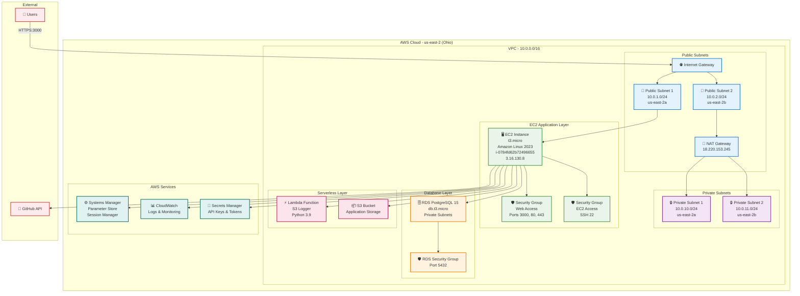
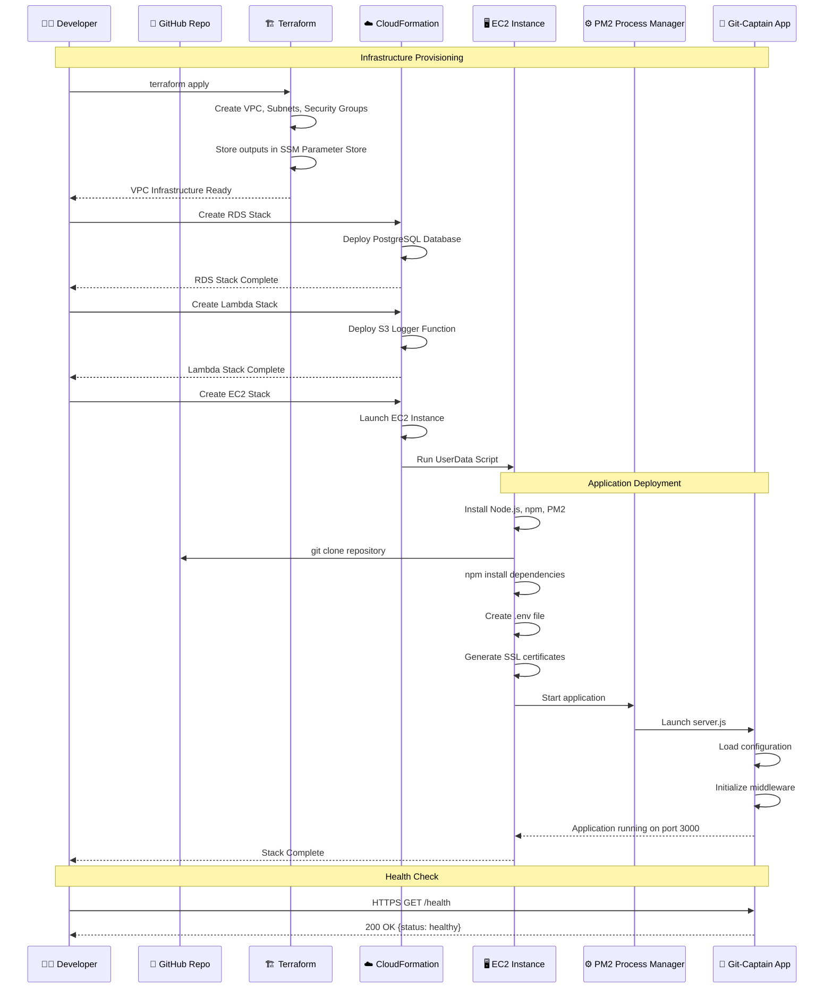
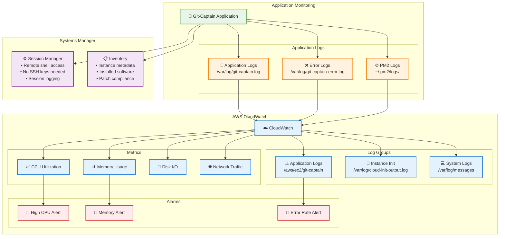

# Git-Captain AWS Architecture

## 🌐 AWS Deployment Overview

Git-Captain is deployed on AWS using a combination of Infrastructure as Code (Terraform) and CloudFormation templates for scalable, secure cloud hosting.

## 🏗️ AWS Infrastructure Architecture



## 📋 Deployed Resources Summary

### **Account Information**
- **AWS Account ID**: 428207760450
- **Region**: us-east-2 (Ohio)
- **Deployment Date**: December 2, 2025

### **VPC Infrastructure (Terraform)**
| Resource | ID/Value | Details |
|----------|----------|---------|
| VPC | vpc-09e36bc10493d4534 | 10.0.0.0/16 CIDR |
| Public Subnet 1 | subnet-005455db03caf1d67 | 10.0.1.0/24, us-east-2a |
| Public Subnet 2 | subnet-0e65b006d61c61227 | 10.0.2.0/24, us-east-2b |
| Private Subnet 1 | subnet-0c6df6c1c5a9f4eca | 10.0.10.0/24, us-east-2a |
| Private Subnet 2 | subnet-0ef57b60bae69f1d2 | 10.0.11.0/24, us-east-2b |
| Internet Gateway | igw-* | Attached to VPC |
| NAT Gateway | nat-* | EIP: 18.220.153.245 |
| ALB Security Group | sg-009be60401d3e7294 | Ports 80, 443 |
| EC2 Security Group | sg-021f21d7a61e9e0ae | Port 22, 3000 |
| RDS Security Group | sg-0adc8983160f4d59e | Port 5432 |
| Lambda Security Group | sg-0ada661159d6087ab | Outbound only |

### **EC2 Application (CloudFormation)**
| Component | Value | Details |
|-----------|-------|---------|
| **Instance ID** | i-0784fd62b72496655 | Running |
| **Instance Type** | t3.micro | 2 vCPU, 1 GB RAM |
| **AMI** | Amazon Linux 2023 | ami-0490fddec0cbeb88b |
| **Public IP** | 3.16.130.8 | Elastic IP not configured |
| **Public DNS** | ec2-3-16-130-8.us-east-2.compute.amazonaws.com | |
| **Application URL** | https://3.16.130.8:3000 | Self-signed SSL |
| **IAM Role** | git-captain-prod-ec2-role | Systems Manager access |
| **CloudWatch Agent** | Installed | Metrics & logs |

### **RDS PostgreSQL (CloudFormation)**
| Component | Value | Details |
|-----------|-------|---------|
| **Stack Name** | git-captain-rds | CREATE_COMPLETE |
| **Engine** | PostgreSQL 15 | Latest minor version |
| **Instance Class** | db.t3.micro | Free tier eligible |
| **Storage** | 20 GB GP2 | General Purpose SSD |
| **Backup Retention** | 1 day | Free tier limit |
| **Multi-AZ** | Disabled | Cost optimization |
| **Encryption** | Enabled | At rest |
| **Subnet Group** | Private subnets | us-east-2a, us-east-2b |

### **Lambda Function (CloudFormation)**
| Component | Value | Details |
|-----------|-------|---------|
| **Stack Name** | git-captain-lambda | CREATE_COMPLETE |
| **Function Name** | git-captain-s3-logger | |
| **Runtime** | Python 3.9 | |
| **Memory** | 128 MB | |
| **Timeout** | 30 seconds | |
| **Trigger** | S3 Event | On object creation |
| **IAM Role** | Named role | CloudWatch logs access |

### **Application Files Location**
| Path | Description |
|------|-------------|
| `/opt/git-captain/` | Application root directory |
| `/opt/git-captain/controllers/server.js` | Main Node.js application |
| `/opt/git-captain/.env` | Environment configuration |
| `/opt/git-captain/controllers/theKey.key` | SSL private key (self-signed) |
| `/opt/git-captain/controllers/theCert.cert` | SSL certificate (self-signed) |
| `/var/log/git-captain.log` | Application logs |
| `/var/log/git-captain-error.log` | Error logs |

## 🔄 Application Deployment Flow



## 🛡️ Security Architecture

```mermaid
graph TB
    subgraph "Network Security"
        Internet[🌍 Internet]
        IGW[🌐 Internet Gateway]
        
        subgraph "Public Access"
            WebSG[🛡️ Web Security Group<br/>Inbound:<br/>• TCP 3000 (0.0.0.0/0)<br/>• TCP 443 (0.0.0.0/0)<br/>• TCP 80 (0.0.0.0/0)]
        end
        
        subgraph "Private Access"
            DBSG[🔒 Database Security Group<br/>Inbound:<br/>• TCP 5432 (from EC2 SG)<br/>Outbound: None]
            LambdaSG[⚡ Lambda Security Group<br/>Outbound only]
        end
    end
    
    subgraph "Application Security"
        EC2[🖥️ EC2 Instance]
        
        subgraph "Instance Security"
            IAM[🔐 IAM Instance Role<br/>• SSM Session Manager<br/>• CloudWatch Logs<br/>• Secrets Manager Read<br/>• S3 Read/Write]
            SSL[🔒 SSL/TLS<br/>• Self-signed certificate<br/>• HTTPS on port 3000]
            PM2[⚙️ PM2 Process Manager<br/>• Auto-restart<br/>• Log rotation]
        end
        
        subgraph "Application Security"
            Helmet[🛡️ Helmet.js<br/>Security Headers]
            CORS[🔗 CORS Protection]
            RateLimit[⏱️ Rate Limiting<br/>• 200 req/15min general<br/>• 300 req/5min auth]
            Validation[✅ Input Validation<br/>express-validator]
        end
    end
    
    subgraph "Data Security"
        RDS[🗄️ RDS Encrypted<br/>• At-rest encryption<br/>• SSL connections<br/>• Private subnet only]
        Secrets[🔐 AWS Secrets Manager<br/>• GitHub credentials<br/>• API keys<br/>• Database passwords]
        SSM[⚙️ SSM Parameter Store<br/>• Infrastructure IDs<br/>• Non-sensitive config]
    end
    
    Internet --> IGW
    IGW --> WebSG
    WebSG --> EC2
    EC2 --> IAM
    EC2 --> SSL
    EC2 --> PM2
    EC2 --> Helmet
    EC2 --> CORS
    EC2 --> RateLimit
    EC2 --> Validation
    EC2 --> DBSG
    DBSG --> RDS
    EC2 --> Secrets
    EC2 --> SSM
    
    classDef network fill:#e3f2fd,stroke:#1976d2,stroke-width:2px
    classDef instance fill:#e8f5e8,stroke:#388e3c,stroke-width:2px
    classDef security fill:#fff3e0,stroke:#f57c00,stroke-width:2px
    classDef data fill:#f3e5f5,stroke:#7b1fa2,stroke-width:2px
    
    class Internet,IGW,WebSG network
    class EC2,IAM,SSL,PM2 instance
    class Helmet,CORS,RateLimit,Validation,DBSG,LambdaSG security
    class RDS,Secrets,SSM data
```

## 📊 Monitoring & Logging



## 💰 Cost Optimization

### Free Tier Resources (First 12 Months)
- ✅ **EC2 t3.micro**: 750 hours/month free
- ✅ **RDS db.t3.micro**: 750 hours/month free
- ✅ **RDS Storage**: 20 GB free
- ✅ **Lambda**: 1M requests/month free
- ✅ **CloudWatch**: Basic monitoring free
- ✅ **Systems Manager**: No charge

### Monthly Cost Estimate (After Free Tier)
| Resource | Monthly Cost |
|----------|--------------|
| EC2 t3.micro | ~$7.50 |
| RDS db.t3.micro | ~$12.50 |
| RDS Storage 20GB | ~$2.30 |
| NAT Gateway | ~$32.00 |
| Data Transfer | ~$0-5 |
| **Total** | **~$54-59/month** |

### Cost Optimization Strategies
1. **Stop instances when not in use** (development)
2. **Use Spot Instances** for non-production
3. **Enable RDS storage autoscaling** instead of over-provisioning
4. **Use VPC Endpoints** instead of NAT Gateway (future)
5. **Implement CloudFront** for static asset caching
6. **Schedule automated stop/start** for off-hours

## 🔄 Deployment Workflows

### Initial Deployment
```bash
# 1. Deploy VPC Infrastructure
cd terraform/
terraform init
terraform plan
terraform apply

# 2. Deploy RDS Database
aws cloudformation create-stack \
  --stack-name git-captain-rds \
  --template-body file://cloudformation/rds.yaml \
  --capabilities CAPABILITY_IAM \
  --region us-east-2

# 3. Deploy Lambda Function
aws cloudformation create-stack \
  --stack-name git-captain-lambda \
  --template-body file://cloudformation/lambda-s3-logging.yaml \
  --capabilities CAPABILITY_NAMED_IAM \
  --region us-east-2

# 4. Deploy EC2 Application
aws cloudformation create-stack \
  --stack-name git-captain-ec2-simple \
  --template-body file://cloudformation/ec2-simple.yaml \
  --capabilities CAPABILITY_NAMED_IAM \
  --region us-east-2
```

### Application Updates
```bash
# Connect via Systems Manager
aws ssm start-session --target i-0784fd62b72496655 --region us-east-2

# Update application
cd /opt/git-captain
git pull origin feature/AWS
npm install
pm2 restart git-captain
```

### Infrastructure Updates
```bash
# Update VPC infrastructure
cd terraform/
terraform plan
terraform apply

# Update CloudFormation stacks
aws cloudformation update-stack \
  --stack-name git-captain-ec2-simple \
  --template-body file://cloudformation/ec2-simple.yaml \
  --capabilities CAPABILITY_NAMED_IAM \
  --region us-east-2
```

## 🚨 Troubleshooting

### Common Issues

**Application not responding on port 3000:**
```bash
# Check PM2 status
export HOME=/root
pm2 list
pm2 logs git-captain

# Check if port is listening
netstat -tlnp | grep 3000
ss -tlnp | grep 3000

# Restart application
pm2 restart git-captain
```

**SSL/TLS connection issues:**
```bash
# Regenerate self-signed certificates
cd /opt/git-captain
openssl req -x509 -newkey rsa:2048 -nodes \
  -keyout controllers/theKey.key \
  -out controllers/theCert.cert \
  -days 365 -subj '/CN=git-captain'

# Restart application
pm2 restart git-captain
```

**Cannot access EC2 instance:**
```bash
# Use Systems Manager Session Manager (no SSH key needed)
aws ssm start-session --target i-0784fd62b72496655 --region us-east-2

# Check security group rules
aws ec2 describe-security-groups \
  --group-ids sg-021f21d7a61e9e0ae \
  --region us-east-2
```

## 📚 Related Documentation

- [AWS Deployment Checklist](../../AWS_DEPLOYMENT_CHECKLIST.md)
- [AWS Implementation Summary](../../AWS_IMPLEMENTATION_SUMMARY.md)
- [AWS Quick Reference](../../AWS_QUICK_REFERENCE.md)
- [Deployment Summary](../../DEPLOYMENT_SUMMARY.md)
- [Main Architecture](../ARCHITECTURE.md)

---

*AWS Architecture documented for Git-Captain v2.0 AWS deployment completed December 2, 2025*
