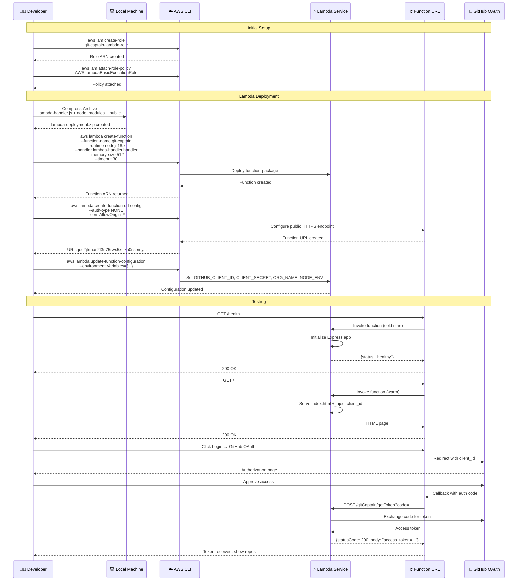

# Git-Captain AWS Architecture

## 🌐 AWS Deployment Overview

Git-Captain is deployed as a serverless application on AWS Lambda with Function URL, providing a scalable, cost-effective solution without infrastructure management.

## 🏗️ Current AWS Architecture - Serverless Lambda

```mermaid
graph TB
    subgraph "AWS Cloud - us-east-2 (Ohio)"
        subgraph "Serverless Application Layer"
            FunctionURL[🌐 Lambda Function URL<br/>Public HTTPS Endpoint<br/>CORS Enabled<br/>joc2jtrmas2f3n75rwx5xtilka0ssomy.lambda-url.us-east-2.on.aws]
            
            subgraph "Lambda Function: git-captain"
                Handler[⚡ Lambda Handler<br/>lambda-handler.js<br/>Monolithic Express App]
                Runtime[🚀 Node.js 18.x Runtime<br/>512 MB Memory<br/>30s Timeout]
                
                subgraph "Application Routes"
                    Health[GET /health]
                    Status[GET /gitCaptain/checkGitHubStatus]
                    Static[GET /static/*]
                    Home[GET /]
                    Auth[GET /authenticated.html]
                    Config[GET /config.js]
                    Token[POST /gitCaptain/getToken]
                    Repos[POST /gitCaptain/searchForRepos]
                    CreateBr[POST /gitCaptain/createBranches]
                    DeleteBr[DELETE /gitCaptain/deleteBranches]
                    SearchBr[POST /gitCaptain/searchForBranch]
                    SearchPR[POST /gitCaptain/searchForPR]
                    LogOff[POST /gitCaptain/logOff]
                end
                
                Wrapper[📦 serverless-http<br/>Express to Lambda adapter]
            end
            
            IAM[🔐 IAM Role<br/>git-captain-lambda-role<br/>AWSLambdaBasicExecutionRole]
        end
        
        subgraph "AWS Services"
            CW[📊 CloudWatch Logs<br/>/aws/lambda/git-captain<br/>Function execution logs]
            Env[⚙️ Environment Variables<br/>GITHUB_CLIENT_ID<br/>GITHUB_CLIENT_SECRET<br/>GITHUB_ORG_NAME<br/>NODE_ENV=production]
        end
    end
    
    subgraph "External Services"
        Users[👥 Users<br/>Web Browsers]
        GitHub[🐙 GitHub API<br/>api.github.com<br/>Repository operations]
        OAuth[🔑 GitHub OAuth<br/>github.com/login/oauth<br/>Authentication]
    end
    
    Users -->|HTTPS| FunctionURL
    FunctionURL --> Handler
    Handler --> Wrapper
    Wrapper --> Runtime
    
    Handler --> Health
    Handler --> Status
    Handler --> Static
    Handler --> Home
    Handler --> Auth
    Handler --> Config
    Handler --> Token
    Handler --> Repos
    Handler --> CreateBr
    Handler --> DeleteBr
    Handler --> SearchBr
    Handler --> SearchPR
    Handler --> LogOff
    
    Home --> Env
    Auth --> Env
    Config --> Env
    Token --> OAuth
    Token --> Env
    Repos --> GitHub
    Repos --> Env
    CreateBr --> GitHub
    DeleteBr --> GitHub
    SearchBr --> GitHub
    SearchPR --> GitHub
    LogOff --> OAuth
    
    Runtime --> IAM
    Runtime --> CW
    
    classDef serverless fill:#fce4ec,stroke:#c2185b,stroke-width:3px
    classDef routes fill:#e3f2fd,stroke:#1976d2,stroke-width:1px
    classDef services fill:#e0f2f1,stroke:#00695c,stroke-width:2px
    classDef external fill:#ffebee,stroke:#d32f2f,stroke-width:2px
    classDef config fill:#fff3e0,stroke:#f57c00,stroke-width:2px
    
    class FunctionURL,Handler,Runtime,Wrapper serverless
    class Health,Status,Static,Home,Auth,Config,Token,Repos,CreateBr,DeleteBr,SearchBr,SearchPR,LogOff routes
    class CW services
    class Users,GitHub,OAuth external
    class IAM,Env config
```



## 📋 Deployed Resources Summary

### **Account Information**
- **AWS Account ID**: 428207760450
- **Region**: us-east-2 (Ohio)
- **Deployment Date**: December 7, 2025
- **Deployment Type**: Serverless (AWS Lambda with Function URL)

### **Lambda Function**
| Component | Value | Details |
|-----------|-------|---------|
| **Function Name** | git-captain | Active |
| **Runtime** | Node.js 18.x | Latest stable |
| **Memory** | 512 MB | Optimized for Express app |
| **Timeout** | 30 seconds | For OAuth and GitHub API calls |
| **Handler** | lambda-handler.handler | Monolithic Express application |
| **Architecture** | x86_64 | Standard architecture |
| **Package Type** | Zip | Deployed via CLI |

### **Function URL Configuration**
| Component | Value | Details |
|-----------|-------|---------|
| **Function URL** | https://joc2jtrmas2f3n75rwx5xtilka0ssomy.lambda-url.us-east-2.on.aws/ | Public endpoint |
| **Auth Type** | NONE | Public access |
| **CORS** | Enabled | AllowOrigin: *, AllowMethods: GET,POST,DELETE |
| **Invoke Mode** | BUFFERED | Standard request/response |

### **IAM Role**
| Component | Value | Details |
|-----------|-------|---------|
| **Role Name** | git-captain-lambda-role | Lambda execution role |
| **Managed Policies** | AWSLambdaBasicExecutionRole | CloudWatch Logs access |
| **Trust Policy** | lambda.amazonaws.com | Standard Lambda service principal |

### **Environment Variables**
| Variable | Description | Source |
|----------|-------------|--------|
| `GITHUB_CLIENT_ID` | OAuth App Client ID | Ov23liLoGipH7oguOHql |
| `GITHUB_CLIENT_SECRET` | OAuth App Secret | 94e85b2fb0261083d6585497cdd18a5a0685d8d6 |
| `GITHUB_ORG_NAME` | Target GitHub Organization | ConfusedDeer |
| `NODE_ENV` | Node.js environment | production |

### **Dependencies (package.json)**
| Package | Version | Purpose |
|---------|---------|---------|
| express | ^4.18.2 | Web framework |
| serverless-http | ^3.2.0 | Lambda-Express adapter |
| axios | ^1.6.0 | HTTP client for GitHub API |
| body-parser | ^1.20.2 | Request body parsing |

## 🔄 Application Deployment Flow



## 🛡️ Security Architecture

```mermaid
graph TB
    subgraph "Network Security"
        Internet[🌍 Internet<br/>Public Access]
        FnURL[🌐 Lambda Function URL<br/>HTTPS Only<br/>No WAF currently]
    end
    
    subgraph "Lambda Security"
        subgraph "Execution Role"
            IAM[🔐 IAM Role<br/>git-captain-lambda-role<br/>Least Privilege]
            CWPolicy[📊 CloudWatch Logs<br/>Write access only]
        end
        
        subgraph "Function Security"
            Runtime[🚀 Isolated Runtime<br/>Per-request container<br/>Read-only /var/task]
            Env[🔒 Environment Variables<br/>Encrypted at rest<br/>OAuth credentials]
            TmpFS[💾 /tmp Directory<br/>Writable, ephemeral<br/>10 GB limit]
        end
        
        subgraph "Application Security"
            Express[⚙️ Express.js App<br/>No Helmet (incompatible)<br/>No Rate Limiting (stateless)]
            Validation[✅ Input Validation<br/>Request body parsing<br/>Query parameter checks]
            CORS[🌐 CORS<br/>AllowOrigin: *<br/>AllowMethods: GET,POST,DELETE]
        end
    end
    
    subgraph "Data Security"
        subgraph "Secrets Management"
            EnvVars[📝 Lambda Environment Variables<br/>• GITHUB_CLIENT_ID<br/>• GITHUB_CLIENT_SECRET<br/>• GITHUB_ORG_NAME<br/>Encrypted with AWS KMS]
        end
        
        subgraph "Communication"
            HTTPS[🔒 HTTPS/TLS<br/>AWS-managed certificate<br/>TLS 1.2+]
            GitHub[🐙 GitHub API<br/>OAuth tokens<br/>HTTPS only]
        end
    end
    
    subgraph "Monitoring & Logging"
        CloudWatch[📊 CloudWatch Logs<br/>/aws/lambda/git-captain<br/>Request/response logs<br/>Error tracking]
    end
    
    Internet --> FnURL
    FnURL --> IAM
    IAM --> CWPolicy
    IAM --> Runtime
    Runtime --> Express
    Runtime --> Env
    Runtime --> TmpFS
    Express --> Validation
    Express --> CORS
    Env --> EnvVars
    Express --> HTTPS
    HTTPS --> GitHub
    Runtime --> CloudWatch
    
    classDef network fill:#e3f2fd,stroke:#1976d2,stroke-width:2px
    classDef lambda fill:#fce4ec,stroke:#c2185b,stroke-width:2px
    classDef security fill:#fff3e0,stroke:#f57c00,stroke-width:2px
    classDef data fill:#f3e5f5,stroke:#7b1fa2,stroke-width:2px
    classDef monitoring fill:#e8f5e8,stroke:#388e3c,stroke-width:2px
    
    class Internet,FnURL network
    class IAM,CWPolicy,Runtime,Env,TmpFS,Express,Validation,CORS lambda
    class EnvVars,HTTPS,GitHub security
    class CloudWatch monitoring
```

## 📊 Monitoring & Logging

```mermaid
graph TB
    subgraph "Lambda Execution"
        Lambda[⚡ git-captain Lambda]
        
        subgraph "Application Logs"
            ConsoleLog[📝 console.log()<br/>Standard output]
            ConsoleWarn[⚠️ console.warn()<br/>Warnings]
            ConsoleError[❌ console.error()<br/>Errors & stack traces]
        end
        
        subgraph "Request Tracking"
            ReqLog[📊 Request logging<br/>Method, path, body]
            RespLog[📤 Response logging<br/>Status code, body size]
            Duration[⏱️ Execution duration<br/>Cold vs warm start]
        end
    end
    
    subgraph "AWS CloudWatch"
        CW[☁️ CloudWatch Service]
        
        subgraph "Log Streams"
            LogGroup[📁 Log Group<br/>/aws/lambda/git-captain]
            LogStream[📄 Log Streams<br/>YYYY/MM/DD/[$LATEST]requestId]
        end
        
        subgraph "Metrics"
            Invocations[📊 Invocations<br/>Total function calls]
            Errors[❌ Errors<br/>Function failures]
            Duration2[⏱️ Duration<br/>Average execution time]
            Throttles[🚫 Throttles<br/>Concurrent limit hits]
            ColdStarts[❄️ Cold Starts<br/>Init duration tracking]
        end
        
        subgraph "Insights"
            LogInsights[🔍 CloudWatch Logs Insights<br/>Query and analyze logs]
            Alarms[🚨 CloudWatch Alarms<br/>Error rate threshold]
        end
    end
    
    Lambda --> ConsoleLog
    Lambda --> ConsoleWarn
    Lambda --> ConsoleError
    Lambda --> ReqLog
    Lambda --> RespLog
    Lambda --> Duration
    
    ConsoleLog --> LogGroup
    ConsoleWarn --> LogGroup
    ConsoleError --> LogGroup
    ReqLog --> LogGroup
    RespLog --> LogGroup
    
    LogGroup --> LogStream
    LogGroup --> LogInsights
    
    Lambda --> Invocations
    Lambda --> Errors
    Lambda --> Duration2
    Lambda --> Throttles
    Lambda --> ColdStarts
    
    Errors --> Alarms
    
    classDef execution fill:#e3f2fd,stroke:#1976d2,stroke-width:2px
    classDef logs fill:#fff3e0,stroke:#f57c00,stroke-width:2px
    classDef cloudwatch fill:#e8f5e8,stroke:#388e3c,stroke-width:2px
    classDef metrics fill:#f3e5f5,stroke:#7b1fa2,stroke-width:2px
    
    class Lambda execution
    class ConsoleLog,ConsoleWarn,ConsoleError,ReqLog,RespLog,Duration logs
    class CW,LogGroup,LogStream,LogInsights,Alarms cloudwatch
    class Invocations,Errors,Duration2,Throttles,ColdStarts metrics
```
            NetMetric[🌐 Network Traffic]
        end
        
        subgraph "Alarms"
            HighCPU[🚨 High CPU Alert]
            HighMem[🚨 Memory Alert]
            AppError[🚨 Error Rate Alert]
        end
    end
    
    subgraph "Systems Manager"
        SSM[⚙️ Session Manager<br/>• Remote shell access<br/>• No SSH keys needed<br/>• Session logging]
        Inventory[📋 Inventory<br/>• Instance metadata<br/>• Installed software<br/>• Patch compliance]
    end
    
    App --> AppLog
    App --> ErrLog
    App --> PM2Log
    
    AppLog --> CW
    ErrLog --> CW
    PM2Log --> CW
    
    CW --> CWApp
    CW --> CWInit
    CW --> CWSystem
    CW --> CPUMetric
    CW --> MemMetric
    CW --> DiskMetric
    CW --> NetMetric
    
    CPUMetric --> HighCPU
    MemMetric --> HighMem
    CWApp --> AppError
    
    App --> SSM
    App --> Inventory
    
    classDef app fill:#e8f5e8,stroke:#388e3c,stroke-width:2px
    classDef logs fill:#fff3e0,stroke:#f57c00,stroke-width:2px
    classDef cloudwatch fill:#e3f2fd,stroke:#1976d2,stroke-width:2px
    classDef alerts fill:#ffebee,stroke:#d32f2f,stroke-width:2px
    classDef ssm fill:#f3e5f5,stroke:#7b1fa2,stroke-width:2px
    
    class App app
    class AppLog,ErrLog,PM2Log logs
    class CW,CWApp,CWInit,CWSystem,CPUMetric,MemMetric,DiskMetric,NetMetric cloudwatch
    class HighCPU,HighMem,AppError alerts
    class SSM,Inventory ssm
```

## 💰 Cost Optimization

### AWS Lambda Pricing (Always Free Tier)
- ✅ **Lambda Requests**: 1M requests/month free forever
- ✅ **Lambda Compute**: 400,000 GB-seconds free/month forever
- ✅ **CloudWatch Logs**: 5 GB ingestion + 5 GB storage free
- ✅ **Function URL**: No additional charge

### Current Monthly Cost Estimate
| Resource | Usage | Cost |
|----------|-------|------|
| Lambda Invocations | ~5,000/month (estimated) | **$0.00** (within free tier) |
| Lambda Compute (512MB, 500ms avg) | ~2,500 GB-seconds | **$0.00** (within free tier) |
| CloudWatch Logs | ~500 MB/month | **$0.00** (within free tier) |
| **Total** | | **$0.00/month** |

### Cost Benefits vs EC2
- **No infrastructure costs**: No EC2, RDS, NAT Gateway charges
- **Pay only for usage**: No idle time charges
- **Automatic scaling**: No over-provisioning
- **No management overhead**: No patching, monitoring costs
- **Estimated savings**: ~$54-59/month compared to EC2 deployment

### Scaling Costs (Beyond Free Tier)
| Monthly Requests | Compute Time | Estimated Cost |
|------------------|--------------|----------------|
| 1M (free tier) | 400K GB-sec | $0.00 |
| 5M | 2M GB-sec | ~$3.60 |
| 10M | 4M GB-sec | ~$7.50 |
| 100M | 40M GB-sec | ~$75.00 |

## 🔄 Deployment Workflows

### Initial Lambda Deployment
```powershell
# 1. Create IAM Role
aws iam create-role `
  --role-name git-captain-lambda-role `
  --assume-role-policy-document '{\"Version\":\"2012-10-17\",\"Statement\":[{\"Effect\":\"Allow\",\"Principal\":{\"Service\":\"lambda.amazonaws.com\"},\"Action\":\"sts:AssumeRole\"}]}' `
  --region us-east-2

# 2. Attach CloudWatch Logs Policy
aws iam attach-role-policy `
  --role-name git-captain-lambda-role `
  --policy-arn arn:aws:iam::aws:policy/service-role/AWSLambdaBasicExecutionRole `
  --region us-east-2

# 3. Package Application
Compress-Archive `
  -Path lambda-handler.js, node_modules, public, package.json `
  -DestinationPath lambda-deployment.zip `
  -CompressionLevel Fastest `
  -Force

# 4. Create Lambda Function
aws lambda create-function `
  --function-name git-captain `
  --runtime nodejs18.x `
  --role arn:aws:iam::428207760450:role/git-captain-lambda-role `
  --handler lambda-handler.handler `
  --zip-file fileb://lambda-deployment.zip `
  --memory-size 512 `
  --timeout 30 `
  --region us-east-2

# 5. Create Function URL
aws lambda create-function-url-config `
  --function-name git-captain `
  --auth-type NONE `
  --cors AllowOrigins='*',AllowMethods='GET,POST,DELETE',AllowHeaders='Content-Type' `
  --region us-east-2

# 6. Add Public Access Permission
aws lambda add-permission `
  --function-name git-captain `
  --statement-id FunctionURLAllowPublicAccess `
  --action lambda:InvokeFunctionUrl `
  --principal '*' `
  --function-url-auth-type NONE `
  --region us-east-2

# 7. Set Environment Variables
aws lambda update-function-configuration `
  --function-name git-captain `
  --environment Variables='{GITHUB_CLIENT_ID=Ov23liLoGipH7oguOHql,GITHUB_CLIENT_SECRET=94e85b2fb0261083d6585497cdd18a5a0685d8d6,GITHUB_ORG_NAME=ConfusedDeer,NODE_ENV=production}' `
  --region us-east-2
```

### Application Updates
```powershell
# 1. Update Code
Compress-Archive `
  -Path lambda-handler.js, node_modules, public, package.json `
  -DestinationPath lambda-deployment.zip `
  -CompressionLevel Fastest `
  -Force

# 2. Deploy Update
aws lambda update-function-code `
  --function-name git-captain `
  --zip-file fileb://lambda-deployment.zip `
  --region us-east-2

# 3. Verify Deployment
aws lambda get-function `
  --function-name git-captain `
  --region us-east-2
```

### Configuration Updates
```powershell
# Update Environment Variables
aws lambda update-function-configuration `
  --function-name git-captain `
  --environment Variables='{GITHUB_CLIENT_ID=new_value,...}' `
  --region us-east-2

# Update Memory/Timeout
aws lambda update-function-configuration `
  --function-name git-captain `
  --memory-size 1024 `
  --timeout 60 `
  --region us-east-2
```

### Monitoring & Debugging
```powershell
# View Recent Logs
aws logs tail /aws/lambda/git-captain --follow --region us-east-2

# Get Function Metrics
aws cloudwatch get-metric-statistics `
  --namespace AWS/Lambda `
  --metric-name Invocations `
  --dimensions Name=FunctionName,Value=git-captain `
  --start-time (Get-Date).AddDays(-1) `
  --end-time (Get-Date) `
  --period 3600 `
  --statistics Sum `
  --region us-east-2

# Invoke Function Directly (Testing)
aws lambda invoke `
  --function-name git-captain `
  --payload '{\"httpMethod\":\"GET\",\"path\":\"/health\"}' `
  --region us-east-2 `
  response.json

# View response
Get-Content response.json
```

## 🚨 Troubleshooting

### Common Lambda Issues

**Function timing out:**
```powershell
# Check timeout setting
aws lambda get-function-configuration `
  --function-name git-captain `
  --region us-east-2 `
  --query 'Timeout'

# Increase timeout if needed
aws lambda update-function-configuration `
  --function-name git-captain `
  --timeout 60 `
  --region us-east-2
```

**Out of memory errors:**
```powershell
# Check memory usage in CloudWatch
aws cloudwatch get-metric-statistics `
  --namespace AWS/Lambda `
  --metric-name MemoryUtilization `
  --dimensions Name=FunctionName,Value=git-captain `
  --start-time (Get-Date).AddHours(-1) `
  --end-time (Get-Date) `
  --period 300 `
  --statistics Maximum `
  --region us-east-2

# Increase memory if needed
aws lambda update-function-configuration `
  --function-name git-captain `
  --memory-size 1024 `
  --region us-east-2
```

**GitHub OAuth not working:**
```powershell
# Verify environment variables
aws lambda get-function-configuration `
  --function-name git-captain `
  --region us-east-2 `
  --query 'Environment.Variables'

# Update if incorrect
aws lambda update-function-configuration `
  --function-name git-captain `
  --environment Variables='{GITHUB_CLIENT_ID=correct_value,...}' `
  --region us-east-2
```

**Function URL not accessible:**
```powershell
# Check Function URL configuration
aws lambda get-function-url-config `
  --function-name git-captain `
  --region us-east-2

# Verify public access permission
aws lambda get-policy `
  --function-name git-captain `
  --region us-east-2
```

**Cold start latency:**
- **Current**: 512 MB memory, typically 1-2s cold start
- **Mitigation**: 
  - Increase memory allocation (more CPU = faster init)
  - Use Provisioned Concurrency (additional cost)
  - Keep functions warm with scheduled pings

### Viewing Logs
```powershell
# Stream live logs
aws logs tail /aws/lambda/git-captain --follow --region us-east-2

# Query specific errors
aws logs filter-log-events `
  --log-group-name /aws/lambda/git-captain `
  --filter-pattern "ERROR" `
  --start-time ((Get-Date).AddHours(-1).ToUniversalTime().Subtract([datetime]'1970-01-01').TotalMilliseconds) `
  --region us-east-2

# Get last 50 log events
aws logs tail /aws/lambda/git-captain --since 1h --region us-east-2
```

## 🔮 Future Enhancements

### Planned: Microservices Architecture
Branch: `feature/seperateLamdaFunctions`

Split monolithic Lambda into 4 microservices with API Gateway:
- **web-server** - Static content and OAuth pages
- **auth-service** - OAuth token exchange
- **repo-service** - Repository operations
- **branch-service** - Branch and PR operations

Benefits:
- Independent scaling per service
- Better fault isolation
- More granular monitoring
- Easier to update individual services

### Additional Improvements
- **CloudFront CDN**: Cache static assets, reduce Lambda invocations
- **WAF Integration**: Add Web Application Firewall for security
- **API Gateway**: Rate limiting, API keys, usage plans
- **Secrets Manager**: Move credentials from environment variables
- **X-Ray Tracing**: Distributed tracing for debugging
- **Lambda Layers**: Share common dependencies across functions

## 📚 Related Documentation

- [Main Architecture](../ARCHITECTURE.md) - Overall system architecture
- [Architecture Diagrams](../ARCHITECTURE_MERMAID.md) - Mermaid diagram collection
- [Lambda Deployment Guide](../../LAMBDA_DEPLOYMENT.md) - Detailed deployment steps
- [Serverless Migration](../../SERVERLESS_MIGRATION_SUMMARY.md) - EC2 to Lambda migration notes

---

*AWS Lambda Architecture documented for Git-Captain v2.0 - Deployed December 7, 2025*
